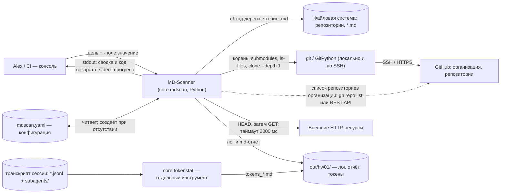
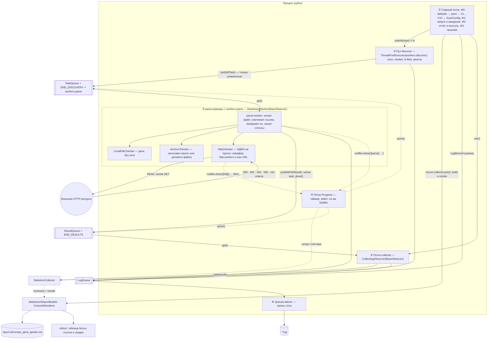
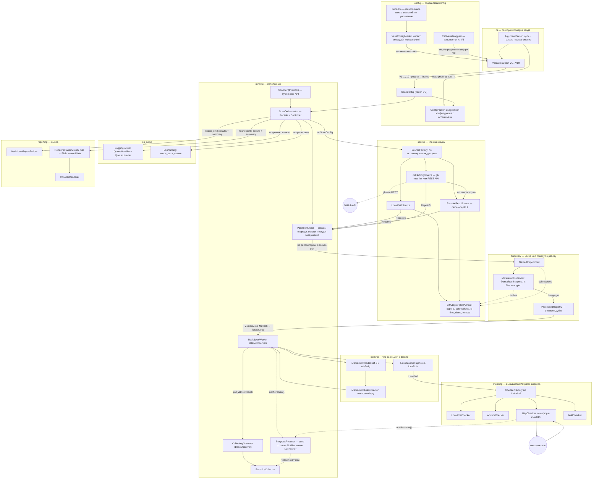
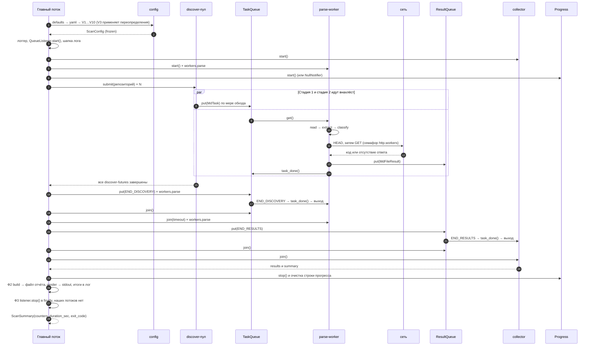
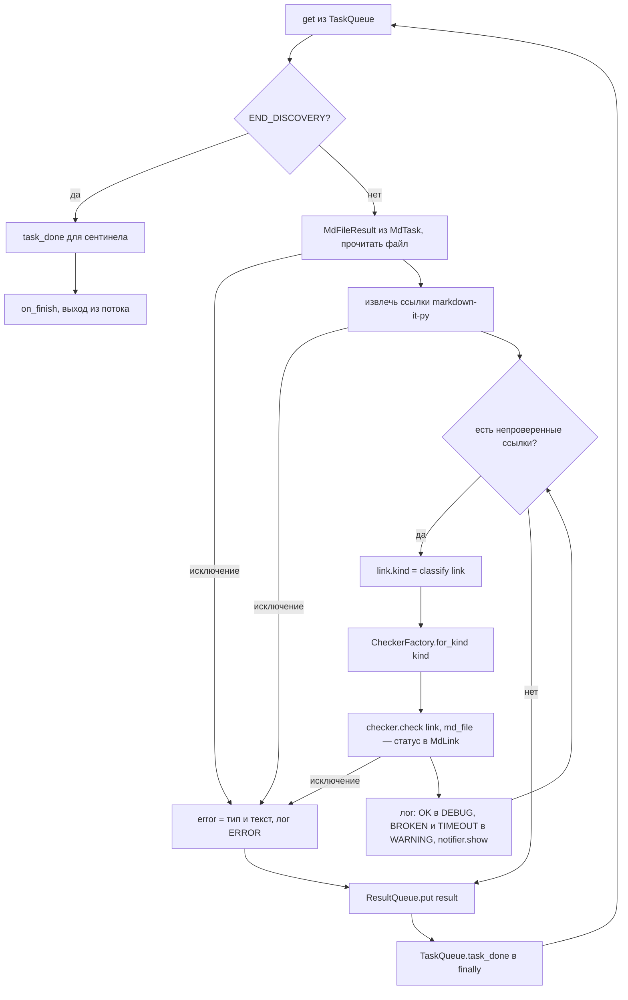
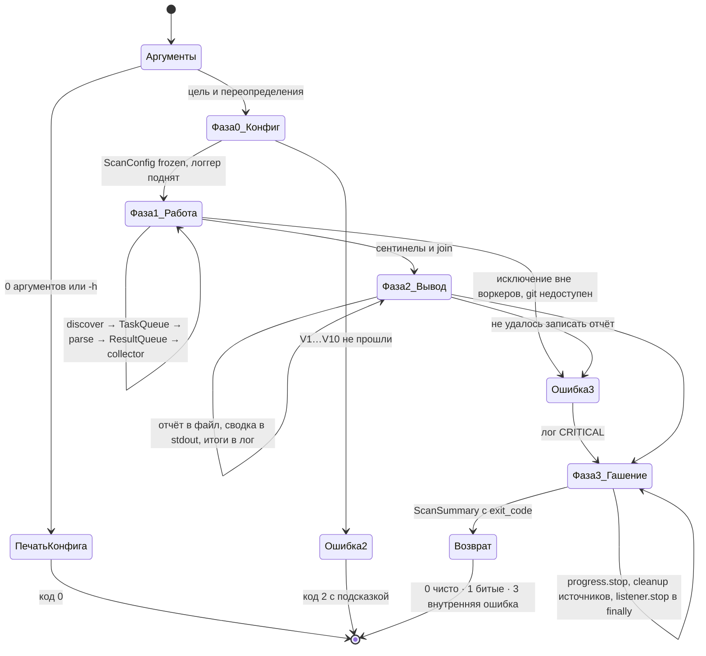

# Модуль `core.mdscan` — сканер Markdown-ссылок в git-репозиториях

> Архитектура модуля: контекст, контейнеры, компоненты, классы, динамика прогона.
> Командная строка, все параметры конфигурации и разбор отчёта — в [CLI.md](CLI.md).
> Домашнее задание, ради которого модуль написан, — [hw01](../../../homework/hw01_mdlinks/README.md).
>
> Источники решений: [часть 1/2 — рассуждения D1–D19](../../../MemoryBank/specs/hw01_mdscan_reasoning_2026-08-16.md),
> [часть 2/2 — архитектура](../../../MemoryBank/specs/hw01_mdscan_architecture_2026-08-16.md),
> [ревью 5](../../../MemoryBank/specs/hw01_mdscan_review5_fixes_2026-08-16.md),
> [правила разработки и тестирования](../../../MemoryBank/specs/hw01_mdscan_dev_test_spec_2026-08-16.md).

---

## 1. Назначение

Утилита обходит git-репозиторий (локальный, удалённый или целую организацию GitHub), находит все
Markdown-файлы, извлекает из них ссылки и проверяет каждую:

| Категория ссылки | Как проверяется |
|---|---|
| `LOCAL` — `docs/a.md`, `../README.md`, `file:///…` | существование файла **относительно папки файла-владельца**; `file://` не проверяется (`SKIPPED`) |
| `ANCHOR` — `#раздел`, `a.md#раздел` | заголовок в своём или в целевом файле, сверка по GitHub-slug |
| `URL`, `GITHUB` | HTTP: `HEAD`, при `405/501` повтор `GET`; таймаут, семафор, кэш по URL |
| `MAILTO`, `TEL`, `WIKILINK`, `FOOTNOTE_URL`, `UNKNOWN` | не проверяются, только считаются (`SKIPPED`) |

На выходе — Markdown-отчёт файлом, цветная сводка в консоли, лог прогона и код возврата
(`0` чисто · `1` есть битые · `2` ошибка аргументов · `3` внутренняя ошибка).

Публичное API пакета — один контракт:

```python
class Scanner(Protocol):
    def scan(self, config: ScanConfig) -> ScanSummary: ...
```

---

## 2. C1 — системный контекст



Шесть внешних связей, и все рабочие: файловая система и git — всегда; GitHub по git-протоколу —
когда цель удалённая; GitHub API или `gh` — когда цель организация (голый SSH листинг не умеет);
внешний HTTP — всегда, этого требует условие ДЗ; `mdscan.yaml` — всегда, создаётся при холодном
старте. `http.enabled: false` — аварийный выключатель для работы без сети и для тестов, а не
признак необязательности проверки.

`core.tokenstat` в сканировании не участвует: это отдельный инструмент процесса, он читает
транскрипт сессии и пишет `tokens_*.md`.

---

## 3. C2 — контуры исполнения внутри одного процесса

Решение: **проверка ссылок выполняется внутри стадии 2**. `http.workers` — не отдельная стадия,
а ограничитель параллелизма HTTP-запросов, общий на процесс. Стадий две, сентинела два.



Три очереди с разными владельцами и разными моментами остановки: `TaskQueue` (стадия 1 → 2),
`ResultQueue` (стадия 2 → вывод), `LogQueue` (логи). Все три создаёт `PipelineRunner` на прогон
и раздаёт через конструкторы — глобального состояния нет.

Почему проверка внутри стадии 2, а не отдельной стадией:

| | Принятый вариант | Отдельная стадия http |
|---|---|---|
| Владение объектом | один владелец до публикации | объект «размазан»: файл готов, ссылки ещё нет |
| Сентинелы | 2 | 3 плюс счётчик «сколько ссылок файла осталось» |
| Сборка результата | естественная | нужен отдельный сборщик недособранных файлов |
| Цена | parse-поток ждёт свои HTTP-ответы | сложность и новый класс ошибок |

Ожидание ограничено таймаутом, кэшем URL и семафором: при `workers.parse: 5` одновременно висит
максимум пять файлов, а не весь прогон.

---

## 4. C3 — компоненты (пакеты и их связи)



Границы пакетов совпадают с осями изменений: источник репозиториев меняется независимо от обхода,
парсер — от проверок, проверки — от вывода. Ни один компонент не зависит одновременно от `source`
и от `reporting`.

---

## 5. C4 — ключевые классы

```mermaid
classDiagram
    class MdLink {
        +str target
        +LinkOrigin origin
        +LinkKind kind
        +int line
        +CheckStatus status
        +str detail
        +int http_code
    }
    class MdFileResult {
        +RepoInfo repo
        +Path md_file
        +str rel_path
        +list~MdLink~ links
        +str error
        +float seconds
        +str thread_name
        +ok bool
        +broken_count int
    }
    class RepoInfo {
        +Path root
        +str remote_url
        +str web_url
        +bool is_nested
        +Path scope
    }
    class MdTask {
        +RepoInfo repo
        +Path md_file
    }
    class ScanConfig {
        +SourceConfig source
        +ScanSection scan
        +WorkersConfig workers
        +ParserConfig parser
        +ChecksConfig checks
        +HttpConfig http
        +ProgressConfig progress
        +LoggingConfig logging
        +ReportConfig report
        +RunConfig run
        +from_draft(draft) ScanConfig
    }
    class ScanSummary {
        +dict counters
        +float duration_sec
        +int exit_code
    }
    class Scanner {
        +scan(config) ScanSummary
    }
    class ScanOrchestrator {
        +scan(config) ScanSummary
        +snapshot() ProgressSnapshot
    }
    class PipelineRunner {
        +start() None
        +run(sources) None
        +results list~MdFileResult~
        +stats StatisticsCollector
        +snapshot() ProgressSnapshot
    }
    class BaseObserver {
        +run() None
        +on_item(item)* None
        +on_error(exc) None
        +on_finish() None
    }
    class MarkdownWorker {
        +on_item(task) None
    }
    class CollectingObserver {
        +list~MdFileResult~ results
        +on_item(result) None
    }
    class StatisticsCollector {
        +add(result) None
        +summary(duration_sec, fail_on_broken) ScanSummary
        +snapshot(task_qsize, result_qsize) ProgressSnapshot
    }
    class Notifier {
        +show(text) None
    }
    class ProgressReporter {
        +show(text) None
        +tick() None
        +stop() None
    }
    class RepositorySource {
        +repositories() Iterable~RepoInfo~
        +cleanup() None
    }
    class SourceFactory {
        +for_config(config) list~RepositorySource~
    }
    class GitAdapter {
        +root_of(path) Path
        +submodules(root) list~Path~
        +listed_md(root, extensions) list~Path~
        +remote_url(root) str
        +clone(url, dst, depth) Path
    }
    class MarkdownFileFinder {
        +find(repo, nested_roots) Iterable~Path~
    }
    class ProcessedRegistry {
        +add_if_absent(key) bool
    }
    class LinkExtractor {
        +extract(text) tuple~MdLink~
    }
    class LinkRule {
        +matches(link) bool
        +kind() LinkKind
    }
    class LinkClassifier {
        +classify(link) LinkKind
    }
    class LinkChecker {
        +check(link, md_file) None
    }
    class CheckerFactory {
        +for_kind(kind) LinkChecker
    }
    class HeadingSource {
        +headings(text) tuple~str~
    }
    class MarkdownReportBuilder {
        +build(results, summary) str
    }
    class ConsoleRenderer {
        +render(results, summary) None
    }

    Scanner <|.. ScanOrchestrator
    BaseObserver <|-- MarkdownWorker
    BaseObserver <|-- CollectingObserver
    Notifier <|.. ProgressReporter
    Notifier <|.. NullNotifier
    RepositorySource <|.. LocalPathSource
    RepositorySource <|.. RemoteRepoSource
    RepositorySource <|.. GitHubOrgSource
    LinkExtractor <|.. MarkdownItLinkExtractor
    HeadingSource <|.. MarkdownItHeadingSource
    LinkRule <|.. WikilinkRule
    LinkRule <|.. FootnoteRule
    LinkRule <|.. AnchorRule
    LinkRule <|.. MailtoRule
    LinkRule <|.. TelRule
    LinkRule <|.. GithubRule
    LinkRule <|.. HttpRule
    LinkRule <|.. FileUrlRule
    LinkRule <|.. LocalPathRule
    LinkChecker <|.. LocalFileChecker
    LinkChecker <|.. AnchorChecker
    LinkChecker <|.. HttpChecker
    LinkChecker <|.. NullChecker
    ConsoleRenderer <|.. RichConsoleRenderer
    ConsoleRenderer <|.. PlainConsoleRenderer

    MdFileResult o-- MdLink
    MdFileResult --> RepoInfo
    MdTask --> RepoInfo

    ScanOrchestrator --> ScanConfig
    ScanOrchestrator --> PipelineRunner
    ScanOrchestrator --> SourceFactory
    ScanOrchestrator --> CheckerFactory
    ScanOrchestrator --> ProgressReporter
    ScanOrchestrator --> MarkdownReportBuilder
    ScanOrchestrator --> ConsoleRenderer
    ScanOrchestrator ..> ScanSummary
    SourceFactory ..> RepositorySource
    SourceFactory --> GitAdapter
    PipelineRunner --> MarkdownWorker
    PipelineRunner --> CollectingObserver
    PipelineRunner --> MarkdownFileFinder
    PipelineRunner --> ProcessedRegistry
    MarkdownFileFinder --> GitAdapter
    ProcessedRegistry ..> MdTask
    MarkdownWorker ..> MdTask
    MarkdownWorker --> LinkExtractor
    MarkdownWorker --> LinkClassifier
    MarkdownWorker --> CheckerFactory
    MarkdownWorker --> Notifier
    MarkdownWorker ..> MdFileResult
    LinkClassifier o-- LinkRule
    CheckerFactory ..> LinkChecker
    CheckerFactory --> HeadingSource
    LinkChecker ..> MdLink
    CollectingObserver --> StatisticsCollector
    StatisticsCollector ..> ScanSummary
    ProgressReporter ..> StatisticsCollector
```



Заметки к схеме:

- `MdFileResult` — единственный носитель данных от разбора до отчёта. Правило владения: пишет
  только поток-владелец, после `put()` в очередь объект не изменяется. Копий и «заморозки» не
  нужно; строго неизменяем только `ScanConfig`.
- `LinkChecker.check()` возвращает `None` — он **пишет в переданную ссылку**, а не создаёт новый
  объект: носитель один.
- `HttpChecker` — один экземпляр на прогон, иначе реальный параллелизм HTTP был бы
  `workers.parse × http.workers`, а не `http.workers`.
- `RepoInfo.scope` — цель-подкаталог репозитория: `root` остаётся git-корнем (от него считаются
  `rel_path` и `web_url`), а файлы берутся только из `scope`.

---

## 6. Динамика прогона

### D1 — последовательность (кто кого ждёт)



Что здесь видно и не видно в C2: стадии перекрываются во времени; `END_DISCOVERY` кладётся
**по одному на каждый** parse-воркер (иначе выйдет только один); `task_done()` — **после**
`put()`, иначе `join()` вернётся раньше времени; прогресс гасится последним и на завершение
не влияет.

### D4 — алгоритм parse-воркера



Цикл, `task_done()` в `finally` и выход по сентинелу живут в `BaseObserver`; в `MarkdownWorker`
написано только тело `on_item`. Ломается конвейер обычно на трёх вещах: `task_done()` должен идти
**после** `put()` и **в каждой** ветке, включая ошибочную и сентинел; выход — только по сентинелу,
а не по «пустой очереди»; исключение на **любом** шаге даёт результат с `error`, который всё равно
публикуется.

### D6 — фазы прогона и коды возврата



| Фаза | Кто | Что на выходе |
|---|---|---|
| 0 Конфиг | главный поток (`__main__`) | `ScanConfig` (frozen), логгер, шапка лога; либо код 0 (печать), либо код 2 |
| 1 Работа | discover-пул, parse-воркеры, collector, progress | `results` и `summary` |
| 2 Вывод | главный поток | `report.dir/<scope>_<ts>.md`, таблица в stdout, строка итогов в логе |
| 3 Гашение | главный поток (`finally`) | потоков нет, клоны убраны, лог дописан |
| Возврат | `ScanOrchestrator.scan()` | `ScanSummary.exit_code` → `sys.exit` или `HomeworkReport.metrics` |

`run.fail_on_broken: false` переводит код `1` в `0` — и только это; файлы и консоль не меняются.

---

## 7. Структура пакета

```text
core/mdscan/
├── __init__.py                  фасад: Scanner, ScanOrchestrator, ScanConfig, ScanSummary
├── __main__.py                  точка входа python -m core.mdscan (фаза 0)
├── scanner.py                   Scanner (Protocol) — публичное API модуля
├── errors.py                    все исключения пакета одним файлом
├── enums/                       link_kind · check_status · link_origin · source_kind
├── models/                      md_link · md_file_result · md_task · repo_info
│                                scan_summary · progress_snapshot
├── config/                      defaults · config_draft · scan_config · yaml_config_loader
│                                cli_override_applier · config_printer
├── cli/                         argument_parser · cli_arguments
│   └── validation/              chain · rule + 10 правил V1…V10 · context · result
├── source/                      repository_source · source_factory · git_adapter
│                                local_path_source · remote_repo_source · github_org_source
├── discovery/                   git_file_lister · nested_repo_finder
│                                markdown_file_finder · processed_registry
├── parsing/                     markdown_reader · link_extractor · markdown_it_link_extractor
│   │                            markdown_it_heading_source · link_classifier
│   └── rules/                   link_rule + 9 правил классификации
├── checking/                    link_checker · heading_source · checker_factory
│                                local_file_checker · anchor_checker · http_checker · null_checker
├── runtime/                     queues · sentinels · base_observer · markdown_worker
│                                collecting_observer · statistics_collector · pipeline_runner
│                                scan_orchestrator · notifier · null_notifier
│                                progress_source · progress_reporter · progress_factory
│                                progress_view · rich_progress_view · plain_progress_view
├── log_setup/                   logging_setup · log_format · log_naming
└── reporting/                   markdown_report_builder · console_renderer · renderer_factory
                                 rich_console_renderer · plain_console_renderer
```

Рядом живёт независимый модуль учёта токенов:

```text
core/tokenstat/
├── token_meter.py               TokenMeter (Protocol)
├── transcript_token_meter.py    реализация: транскрипт сессии + subagents/agent-*.jsonl
├── transcript_reader.py         чтение JSONL, дедупликация по requestId
├── token_aggregator.py          суммы по агентам, таскам, моделям
├── token_report_builder.py      tokens_<дата>_<время>.md
└── models/                      token_usage · token_totals
```

Обвязка ДЗ — [`homework/hw01_mdlinks/`](../../../homework/hw01_mdlinks/README.md):
`task.py` (`Hw01MdLinks(HomeworkTask)`), `solution.py` (`Hw01Metrics`), `support/`
(`FixtureTreeBuilder` — наборы A и B, `expectations.py` — эталон набора A).

---

## 8. Контракты ключевых классов

Сигнатуры приведены по коду; полные докстринги — в самих файлах.

### Публичное API

```python
# core/mdscan/scanner.py
class Scanner(Protocol):
    def scan(self, config: ScanConfig) -> ScanSummary: ...
        # исключений наружу не выпускает: внутренняя ошибка → exit_code == 3 и CRITICAL в лог

# core/mdscan/runtime/scan_orchestrator.py
class ScanOrchestrator:              # Facade + Controller, реализует Scanner и ProgressSource
    def scan(self, config: ScanConfig) -> ScanSummary: ...
    def snapshot(self) -> ProgressSnapshot: ...
```

### Исполнение

```python
# core/mdscan/runtime/pipeline_runner.py — фаза 1 целиком
class PipelineRunner:
    def __init__(self, config: ScanConfig, notifier: Notifier, checkers: CheckerFactory) -> None: ...
    def start(self) -> None: ...                       # поднять collector и parse-воркеров
    def run(self, sources: Sequence[RepositorySource]) -> None: ...   # обход и порядок завершения
    @property
    def results(self) -> list[MdFileResult]: ...
    @property
    def stats(self) -> StatisticsCollector: ...
    def snapshot(self) -> ProgressSnapshot: ...

# core/mdscan/runtime/base_observer.py — Template Method
class BaseObserver(threading.Thread, ABC):
    def __init__(self, q: queue.Queue[Any], sentinel: object, name: str) -> None: ...
    def run(self) -> None: ...                 # get → on_item → task_done в finally → выход по сентинелу
    @abstractmethod
    def on_item(self, item: Any, /) -> None: ...
    def on_error(self, exc: Exception) -> None: ...    # лог ERROR с трейсом, поток живёт
    def on_finish(self) -> None: ...

class MarkdownWorker(BaseObserver):        # потребитель TaskQueue, владелец MdFileResult
    def on_item(self, task: MdTask) -> None: ...

class CollectingObserver(BaseObserver):    # потребитель ResultQueue
    results: list[MdFileResult]
    def on_item(self, result: MdFileResult) -> None: ...

class StatisticsCollector:
    def add(self, result: MdFileResult) -> None: ...
    def add_repo(self, is_nested: bool) -> None: ...
    def repo_done(self) -> None: ...
    def md_found(self, count: int = 1) -> None: ...
    def summary(self, duration_sec: float, fail_on_broken: bool) -> ScanSummary: ...
    def snapshot(self, task_qsize: int, result_qsize: int) -> ProgressSnapshot: ...
```

### Источники и обход

```python
class RepositorySource(Protocol):
    def repositories(self) -> Iterable[RepoInfo]: ...
    def cleanup(self) -> None: ...          # удалить клоны при keep_clones: false; локальный — no-op

class SourceFactory:                        # читает source.targets_resolved, сам ничего не детектит
    def __init__(self, git: GitAdapter, run_gh=None, http_get=None) -> None: ...
    def for_config(self, config: ScanConfig) -> list[RepositorySource]: ...

class MarkdownFileFinder:
    def __init__(self, lister: GitFileLister, extensions, respect_gitignore, include_nested) -> None: ...
    def find(self, repo: RepoInfo, nested_roots: list[Path]) -> Iterable[Path]: ...

class ProcessedRegistry:                    # set под Lock, ключ (repo_root, md_file) после resolve()
    def add_if_absent(self, key: tuple[Path, Path]) -> bool: ...
```

### Разбор и проверка

```python
class LinkExtractor(Protocol):
    def extract(self, text: str) -> tuple[MdLink, ...]: ...

class HeadingSource(Protocol):              # владеет checking, реализует parsing
    def headings(self, text: str) -> tuple[str, ...]: ...

class LinkChecker(Protocol):
    def check(self, link: MdLink, md_file: Path) -> None: ...   # пишет в link, ничего не возвращает

class CheckerFactory:                       # создаётся ОДИН раз на прогон
    def __init__(self, config: ScanConfig, headings: HeadingSource, notifier: Notifier) -> None: ...
    def for_kind(self, kind: LinkKind) -> LinkChecker: ...      # общие экземпляры, не новые
```

Таблица выдачи `CheckerFactory.for_kind`:

| `LinkKind` | Чекер | При выключенной проверке |
|---|---|---|
| `LOCAL` | `LocalFileChecker` (внутри `AnchorChecker` для `a.md#x`) | `checks.local: false` → `NullChecker` |
| `ANCHOR` | `AnchorChecker` | `checks.anchors: false` → `NullChecker` |
| `URL`, `GITHUB` | один и тот же `HttpChecker` | `http.enabled: false` → `NullChecker` |
| `MAILTO`, `TEL`, `WIKILINK`, `FOOTNOTE_URL`, `UNKNOWN` | `NullChecker` | — |

### Прогресс и вывод

```python
class Notifier(Protocol):                   # зона 2: любой модуль пишет строку
    def show(self, text: str) -> None: ...

class ProgressReporter(threading.Thread):   # зона 1 по таймеру; реализует Notifier
    def show(self, text: str) -> None: ...
    def tick(self) -> None: ...
    def stop(self) -> None: ...

class MarkdownReportBuilder:
    def __init__(self, config: ScanConfig, started_at: datetime) -> None: ...
    def build(self, results: Sequence[MdFileResult], summary: ScanSummary) -> str: ...

class ConsoleRenderer(Protocol):
    def render(self, results: Sequence[MdFileResult], summary: ScanSummary) -> None: ...
```

---

## 9. Пример вызова из кода

Так модуль зовёт обвязка ДЗ — см. `Hw01Metrics._config` в
[`homework/hw01_mdlinks/solution.py`](../../../homework/hw01_mdlinks/solution.py):

```python
from pathlib import Path

from core.mdscan import ScanConfig, Scanner, ScanOrchestrator
from core.mdscan.config.config_draft import SOURCE_CMDLINE, ConfigDraft
from core.mdscan.enums.source_kind import SourceKind

target = Path("out/hw01/fixture_tree")
run_dir = Path("out/hw01/reference")

draft = ConfigDraft.from_defaults()                       # значения по умолчанию
draft.assign("source.target", str(target), SOURCE_CMDLINE)
draft.assign("source.targets_resolved", ((str(target), SourceKind.LOCAL),), SOURCE_CMDLINE)
draft.assign("scan.respect_gitignore", False, SOURCE_CMDLINE)   # дерево лежит в out/, git его не отдаст
draft.assign("workers.parse", 5, SOURCE_CMDLINE)
draft.assign("http.enabled", False, SOURCE_CMDLINE)
draft.assign("progress.enabled", False, SOURCE_CMDLINE)
draft.assign("logging.dir", str(run_dir), SOURCE_CMDLINE)
draft.assign("report.dir", str(run_dir), SOURCE_CMDLINE)
draft.assign("run.fail_on_broken", False, SOURCE_CMDLINE)
draft.assign("report.console", False, SOURCE_CMDLINE)

config = ScanConfig.from_draft(draft)                     # frozen Value Object
scanner: Scanner = ScanOrchestrator()
summary = scanner.scan(config)

print(summary.counters["md_files_total"], summary.counters["broken_total"], summary.exit_code)
```

Ключевые моменты:

- `ConfigDraft` изменяем и живёт только до `ScanConfig.from_draft`; `ScanConfig` — неизменяем.
- `source.targets_resolved` в обычном запуске заполняет правило V5 цепочки валидации; в коде его
  задают вручную, потому что цепочка CLI не запускается. Через `-поле:значение` это поле задать
  нельзя (`UnknownFieldError`).
- `scanner` типизирован как `Scanner`, а не как `ScanOrchestrator` — верхний слой зависит от
  абстракции (DIP).

Загрузить конфигурацию из файла вместо ручной сборки:

```python
from core.mdscan.config.yaml_config_loader import YamlConfigLoader

draft = YamlConfigLoader().load(Path("mdscan.yaml"))   # нет файла — создаст с комментариями
```

---

## 10. Паттерны

| Паттерн | Где в модуле |
|---|---|
| Template Method | `BaseObserver.run` |
| Observer (потребитель очереди) | `MarkdownWorker` (TaskQueue) · `CollectingObserver` (ResultQueue) |
| Strategy | `LinkExtractor` · `LinkChecker` · `ConsoleRenderer` · `ProgressView` · `RepositorySource` |
| Chain of Responsibility | `ValidationChain` (V1…V10) · `LinkClassifier` (9 правил) |
| Facade + Controller | `Scanner` → `ScanOrchestrator`; фасад пакета `core.mdscan.__init__` |
| Adapter | `GitAdapter` (GitPython) · `TranscriptReader` (JSONL) |
| Factory Method | `CheckerFactory` · `RendererFactory` · `SourceFactory` · `ProgressFactory` |
| Builder | `MarkdownReportBuilder` · `TokenReportBuilder` |
| Null Object | `NullChecker` · `NullNotifier` |
| Command | `MdTask` |
| Value Object | `ScanConfig`, `RepoInfo`, `MdTask`, `ScanSummary`, `ProgressSnapshot` (frozen) |
| Registry | `ProcessedRegistry` |

---

## 11. Инварианты и чем они закрыты

Все тесты лежат в [`tests/hw01/`](../../../tests/hw01) — 15 файлов, 396 тестов.

| # | Инвариант | Тест |
|---|---|---|
| 1 | `workers.parse` / `workers.discover` — верхние границы одновременных разборов и обходов; `http.workers` — семафор | `test_pipeline.py`, `test_checking.py` |
| 2 | Результат публикует сам воркер, не главный поток | `test_pipeline.py` |
| 3 | `END_DISCOVERY` — после всех discover-futures, ровно `workers.parse` штук | `test_pipeline.py` |
| 4 | `END_RESULTS` — строго после `TaskQueue.join()` и выхода воркеров | `test_pipeline.py` |
| 5 | На каждый `get()` есть `task_done()` в `finally`; ни один `join()` не виснет | `test_pipeline.py` |
| 6 | MD-файл попадает в задачи ровно один раз | `test_discovery.py` |
| 7 | Ошибка одного файла публикуется событием и не останавливает прогон | `test_pipeline.py`, `test_orchestrator.py` |
| 8 | Отчёт строится только после `collector.join()` | `test_orchestrator.py` |
| 9 | Два прогона на одном дереве дают одинаковый отчёт (кроме времени и путей) | `test_orchestrator.py`, `test_reporting.py` |
| 10 | Ссылки внутри code-блоков не извлекаются | `test_parsing.py` |
| 11 | После завершения `threading.enumerate()` не содержит наших потоков | `test_pipeline.py`, `test_orchestrator.py` |
| 12 | `ScanConfig` неизменяем | `test_config.py`, `test_models.py` |
| 13 | Приоритет `defaults < yaml < cmdline` на каждом поле | `test_config.py` |
| 14 | После `put()` поток-владелец объект не изменяет | `test_pipeline.py` |
| 15 | Первый аргумент — всегда цель, иначе код 2 | `test_cli.py` |
| 16 | Строка зоны 2 гаснет через `progress.message_ttl_sec` | `test_progress.py` |
| 17 | `respect_gitignore: true` прячет игнорируемые `.md`, но не новые | `test_discovery.py`, `test_source.py` |
| 18 | `task_done()` — только после `ResultQueue.put(result)` | `test_pipeline.py` |
| 19 | Каждый parse-воркер получает свой `END_DISCOVERY` и вызывает на него `task_done()` | `test_pipeline.py` |
| 20 | К моменту `put()` все ссылки файла уже проверены | `test_pipeline.py` |
| 21 | Организация больше `page_size` раскрывается полностью (пагинация) | `test_source.py` |
| 22 | `HttpChecker` один на прогон: одновременных запросов не больше `http.workers` | `test_checking.py` |
| 23 | Вид цели определяется один раз (V5); `SourceFactory` его не переопределяет | `test_cli.py`, `test_source.py` |
| 24 | Якорь сверяется по GitHub-slug; `a.md#x` проверяет и файл, и заголовок в нём | `test_checking.py` |
| 25 | Отчёт и консоль строит главный поток после `join()`, collector сам ничего не пишет | `test_orchestrator.py` |

Плюс метрики качества на эталонном дереве: `extract_f1 = 1.0` при пороге 0.95 и
`classify_accuracy = 1.0` при пороге 0.98 (`test_parsing.py`, `test_hw01_task.py`).

---

## 12. Что нового узнали по ходу разработки

- **Python 3.14: `threading.Thread._context`.** У `Thread` появился приватный атрибут `_context`;
  наследник, заводящий своё поле с таким же именем, ломает запуск потока. Для `BaseObserver` и
  `ProgressReporter` имена внутренних полей пришлось выбирать с оглядкой на приватные атрибуты
  базового класса — на Python 3.11/3.12 этой ловушки не было.
- **В `mdit-py-plugins` нет плагина `wikilinks`.** Спека называла его наравне с `footnote` и
  `attrs`, но такого плагина в пакете не существует. `[[wiki]]` реализованы **встроенным
  inline-правилом** внутри `MarkdownItLinkExtractor`; имя в `parser.plugins` осталось как флаг
  включения этого правила.
- **Пресет `gfm-like` требует `linkify-it-py`.** Без него `markdown-it-py` гасит `linkify`
  с предупреждением, и голые URL перестают быть ссылками — а значит, часть ссылок молча
  не находится. Пакет добавлен в extra `hw01` отдельной строкой.
- **Цель-подкаталог репозитория.** Если цель — не корень репозитория, а папка внутри него
  (`Doc/Modules/mdscan`), `RepoInfo.root` обязан остаться git-корнем: от него считаются
  `rel_path` в отчёте и `web_url`. Для ограничения обхода добавлено поле `RepoInfo.scope`.
- **`file:///…` нельзя проверять как локальный путь.** Это абсолютный адрес чужой машины;
  попытка резолвить его давала ложную битую ссылку. Итог — `SKIPPED` с пояснением в `detail`.
- **GIL и «параллельность».** Без HTTP разбор Markdown — чисто процессорная работа, потоки её
  не ускоряют: измеренный `speedup ≈ 0.92`. Ожидание 1.5–3× относится к прогону с сетевыми
  проверками. Честное число записано в метрики ДЗ, а не подогнано под спеку.
- **Дубли `requestId` в транскрипте.** Один запрос присутствует в JSONL несколькими строками
  (стриминг) с одинаковым `usage`; без дедупликации по `requestId` суммы токенов завышаются в разы.

---

*Документация модуля `core.mdscan`, 2026-08-17. Реальные числа прогона —
в [README ДЗ hw01](../../../homework/hw01_mdlinks/README.md).*
