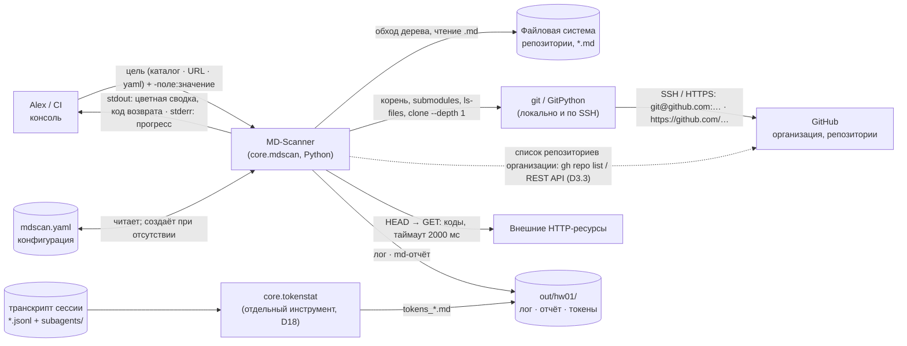
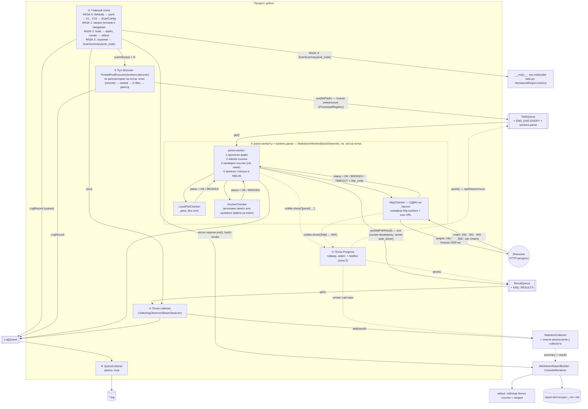
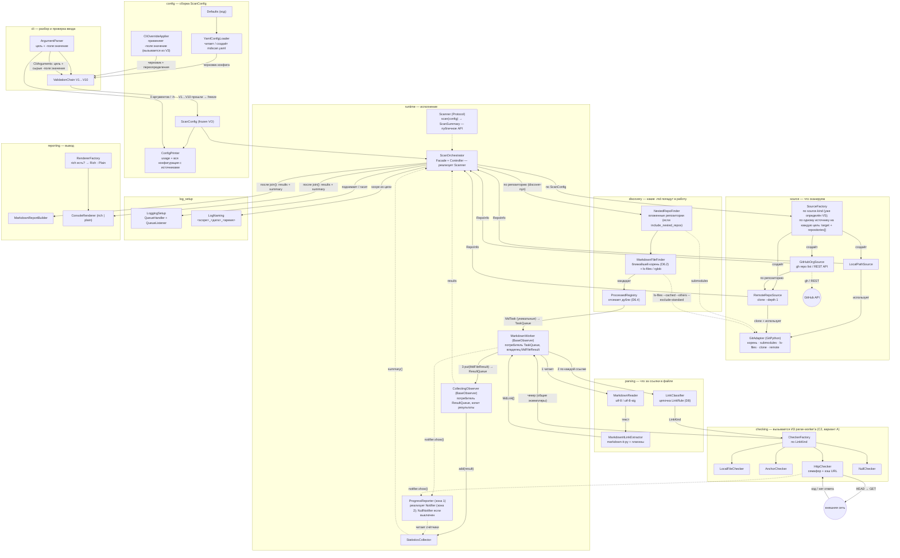
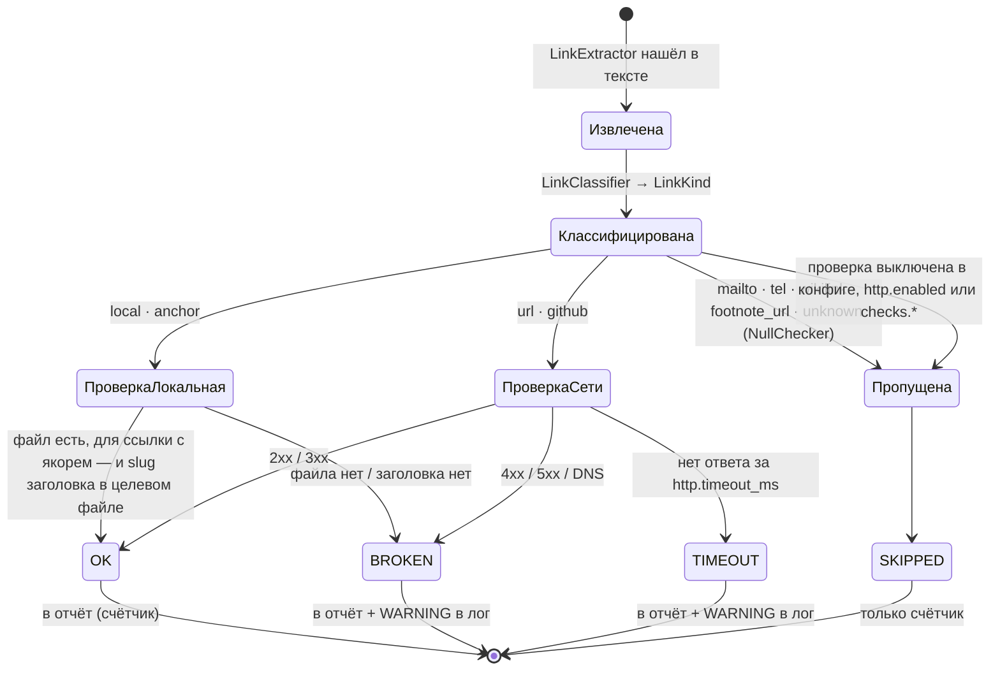
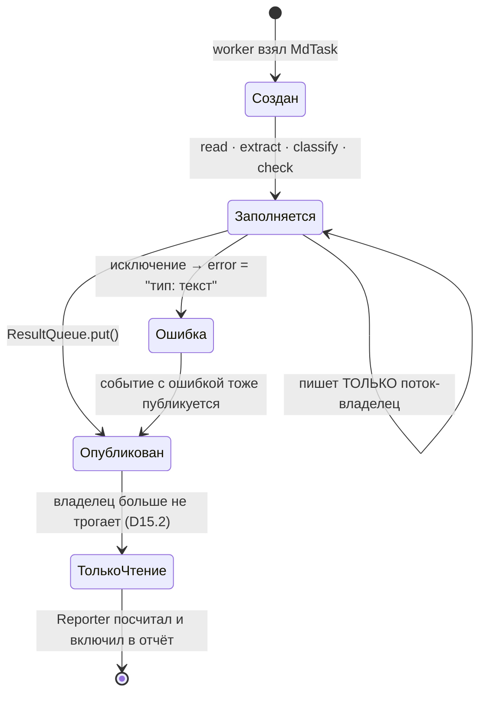
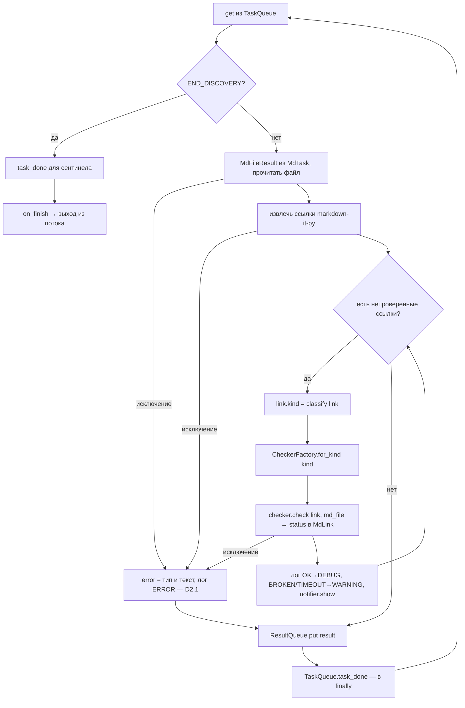
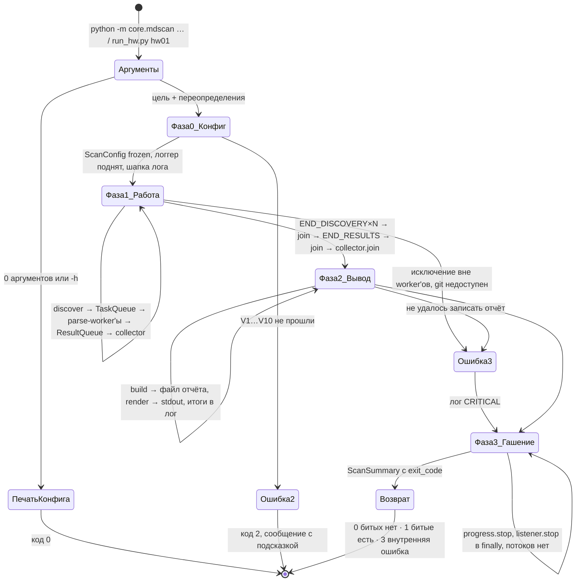

# Спека hw01 «Markdown / Git Scanner» — часть 2/2: архитектура

> **Часть 1/2 (решения и обоснования)**: [`hw01_mdscan_reasoning_2026-08-16.md`](hw01_mdscan_reasoning_2026-08-16.md) —
> Decision Log D1–D19. Здесь — **как устроено**, без повторного обоснования: ссылки вида «(D6.2)»
> ведут в часть 1.
>
> - **Дата**: 2026-08-16 · **Статус**: ✅ принято Alex 2026-08-16 (ревью 1–2) ·
>   ✅ ревью 3 (связи диаграмм ↔ решения части 1) принято Alex 2026-08-16, список:
>   [`hw01_mdscan_review3_fixes_2026-08-16.md`](hw01_mdscan_review3_fixes_2026-08-16.md); в тексте помечены `🔧 ревью 3`
> - Обновлено под решения ревью 1: двухстадийный конвейер, yaml-конфиг, `markdown-it-py`,
>   GitPython, базовый Observer, один объект-носитель, подсчёт токенов.
> - 🔧 Ревью 2 (самопроверка Кодо, 2026-08-16): список правок —
>   [`hw01_mdscan_review2_fixes_2026-08-16.md`](hw01_mdscan_review2_fixes_2026-08-16.md).

---

## 0. 🔴 ОБЯЗАТЕЛЬНО К ИСПОЛНЕНИЮ — трассировка на условие ДЗ

Всё перечисленное ниже — **требования, а не опции**. Реализуется полностью; отключающие ключи
конфигурации существуют только для тестов и работы без сети, значения по умолчанию — «включено».
Пункт считается закрытым, когда зелёный указанный тест.

### 0.1 Из условия курса (`homework/hw01_mdlinks/README.md`)

| # | Требование условия | Где реализуется | Шаг | Тест-гейт |
|---|---|---|---|---|
| T1 | Сканирует указанную папку | `LocalPathSource`, `MarkdownFileFinder` | S5, S6 | обход дерева-фикстуры даёт ожидаемый список |
| T2 | Находит **все** `.md` файлы | `MarkdownFileFinder` (`.md`, `.markdown`) | S6 | число файлов совпадает с эталоном набора A |
| T3 | Извлекает ссылки `[text](url)` | `MarkdownItLinkExtractor` | S7 | golden-набор, `f1 ≥ 0.95` |
| T4 | Извлекает `file:///…` | `FileUrlRule` → `LinkKind.LOCAL` | S7 | параметризованный тест классификации |
| T5 | **Проверяет локальные ссылки на существование** | `LocalFileChecker`, `AnchorChecker` (якорь в своём и в целевом файле, сверка по GitHub-slug) | S10 | живая/битая цель, битый якорь, `a.md#раздел` |
| T6 | **Проверяет внешние HTTP-ссылки на доступность (HEAD или GET)** | `HttpChecker`, `method: head_then_get` | S10 | локальный `http.server`: 200 / 301 / 404 / 500 |
| T7 | **Статус-коды в отчёте** | `MdLink.http_code`, секция отчёта | S10, S11 | отчёт содержит коды по каждой битой ссылке |
| T8 | **Красивый отчёт в консоли (цвета/таблица)** | `RichConsoleRenderer` + `PlainConsoleRenderer` | S11 | таблица строится и с `rich`, и без него |
| T9 | **Список сломанных ссылок** | секции «битые локальные» / «битые HTTP» | S11 | обе секции присутствуют и заполнены |
| T10 | **Относительные пути — относительно файла-владельца** | `LocalFileChecker` (базовый каталог = папка `.md`) | S10 | `../../README.md` из вложенного файла резолвится верно |
| T11 | **Таймауты HTTP** | `http.timeout_ms: 2000`, статус `TIMEOUT` | S10 | «висящий» эндпоинт → `TIMEOUT`, прогон не зависает |
| T12 | **Обработка ошибок сети (404, 500, timeout)** | `HttpChecker` + правило D2.1 | S10 | три исхода различимы: `OK` · `BROKEN` · `TIMEOUT` |

### 0.2 Требования, добавленные нами (обязательны наравне с условием)

| # | Требование | Основание | Шаг | Тест-гейт |
|---|---|---|---|---|
| A1 | Обход git-репозитория; вложенные — по флагу, по умолчанию только главный | D5, D6 | S5, S6 | nested/submodule, файл ровно один раз |
| A2 | Работа с удалённым репозиторием и с организацией (SSH/HTTPS) | D3.3 | S12, S12b | клон `GPUWorkLib`, список репо организации |
| A3 | Двухстадийный конвейер, два сентинела, порядок завершения | D3.1, D4 | S8 | инварианты 1–8, 11, 18–20 |
| A4 | Число потоков — параметры `workers.discover` / `workers.parse` / `http.workers` | D3.2 | S8, S10 | прогон с 1 и с N потоками, `speedup` измерен |
| A5 | Перехват исключений + логирование каждого шага; лог включён по умолчанию | D2.1 | S9 | N строк из N потоков, формат, шапка |
| A6 | Markdown-отчёт файлом, имя `<цель>_<дата>_<время>` | D9 | S11 | обе пары файлов созданы, метка времени одна |
| A7 | Конфигурация `mdscan.yaml` + переопределение `-поле:значение` | D19 | S2, S3 | приоритет defaults < yaml < CLI |
| A8 | Закон CLI: 4 ветки цели, первый аргумент — всегда цель | D12 | S3 | матрица аргументов, коды 0/1/2 |
| A9 | Прогресс: статус по таймеру + строка модуля с TTL 5 с | D3.5 | S11 | прогон с прогрессом и без даёт одинаковый отчёт |
| A10 | Подсчёт токенов (только количество), отчёт отдельным файлом | D18 | S14 | агрегация по агентам, итог «агенты» / «оркестрант» |
| A11 | Документация: README ДЗ с реальными числами + `Doc/Modules/mdscan/` | раздел 0 части 1 | S15 | все разделы заполнены, числа не «работает» |
| A12 | Метрики качества извлечения на golden-наборе | D1 части 1 (набор A), §9.2 | S13 | `f1 ≥ 0.95` (извлечение), `accuracy ≥ 0.98` (классификация) |

### 0.3 Что означает «отключаемо» в конфигурации

| Ключ | Значение по умолчанию | Для чего вообще выключается |
|---|---|---|
| `http.enabled` | `true` | прогон без сети, тесты без внешних вызовов |
| `checks.local` / `checks.anchors` | `true` | быстрый черновой прогон |
| `progress.enabled` | `true` | запуск в CI, где нет терминала |
| `logging.enabled` | `true` | отладка «в чистом виде», без файла |
| `scan.include_nested_repos` | `false` | это **не** отключение функции, а выбор объёма (решение Alex) |

Выключение любого из первых четырёх — **временный режим**, а не признак необязательности пункта.

---

## 1. CLI-контракт

### 1.1 Форма вызова

```bash
python -m core.mdscan <цель> [-поле:значение ...]
```

**ЗАКОН CLI (без вариантов):**

```text
1. Аргументов НЕТ          → печатаем конфигурацию и выходим, код 0.
2. Аргументов ≥ 1          → ПЕРВЫЙ аргумент ВСЕГДА цель (4 ветки, см. 1.1.1).
3. Первый не подходит      → ошибка, код 2.
   ни под одну ветку
4. Остальные аргументы     → только -поле:значение, порядок любой.
```

#### 1.1.1 Четыре ветки цели

| Ветка | Первый аргумент | Что сканируем | Как определяется |
|---|---|---|---|
| локальный каталог | `..\DSP-GPU`, `/home/alex/proj` | папку на диске | путь существует и это каталог |
| один репозиторий | `git@github.com:org/repo.git`, `https://…/repo.git` | клонируем (`--depth 1`) и сканируем | URL заканчивается на `.git` или содержит `<org>/<repo>` |
| организация | `https://github.com/dsp-gpu` | все репозитории организации | URL вида `https://github.com/<имя>` без репозитория |
| **`yaml`** | буквально слово `yaml` | цель(и) из конфига: `source.target` и/или `source.repositories` | точное совпадение со словом |

```bash
python -m core.mdscan yaml                     # всё из конфига, включая перечень адресов
python -m core.mdscan yaml -workers.parse:8    # из конфига + разовое переопределение
```

Спорный случай (например, каталог с именем `yaml`) снимается явным `-source.kind:local`.

✅ **Единственное исключение (Alex, 2026-08-16: «оставь как исключение»)**: `-h` / `--help` / `-?`
первым аргументом = как без аргументов (печать конфига, код 0).

| Часть | Обязателен | Что это |
|---|---|---|
| **1-й аргумент** | да, если аргументы вообще есть | **цель**: каталог · URL репозитория · URL организации · слово `yaml` (см. 1.1.1) |
| `-поле:значение` | нет | любое поле конфигурации, имя = путь в yaml через точку; порядок любой |

**Каталоги лога и отчёта — не позиционные**, задаются полями:
`-logging.dir:out/hw01/logs`, `-report.dir:out/hw01/reports`.

Имена файлов формируются всегда сами: `<scope>_<YYYY-MM-DD>_<HH-MM-SS>.log` / `.md`,
метка времени одна на прогон (D9).

### 1.2 Матрица аргументов

| Что передано | Поведение | Код |
|---|---|---|
| ничего | вывести всю конфигурацию + примеры | `0` |
| цель [+ `-поле:значение` …] | сканировать; остальное из yaml/defaults | `0` / `1` |
| первый аргумент не подходит ни под одну ветку (например `-workers.parse:8`) | ошибка: «первым аргументом должна быть цель: каталог, URL или слово yaml» | `2` |
| второй позиционный | ошибка: «лишний аргумент; каталоги задаются как `-logging.dir:…` / `-report.dir:…`» | `2` |

`-h` / `--help` / `-?` — то же, что запуск без аргументов.

### 1.3 Цепочка валидации (Chain of Responsibility, класс на правило)

🔧 ревью 2: порядок переставлен — переопределения `-поле:значение` разбираются **до** проверки
каталогов (они могут задавать `logging.dir`), нормализация пути — **до** проверок существования.

| # | Класс | Проверка | Код |
|---|---|---|---|
| V1 | `ArgCountRule` | позиционный **ровно один или ни одного** | 2 |
| V2 | `FirstArgIsTargetRule` | если аргументы есть — **первый** обязан быть целью (одна из 4 веток) | 2 |
| V3 | `OverrideSyntaxRule` | каждый `-поле:значение` разобран, поле существует, тип приводится | 2 |
| V4 | `PathNormalizationRule` | `~`, относительные, пробелы, кириллица, UNC → абсолютный `Path` | — |
| V5 | `TargetKindRule` | определяет ветку: каталог · репозиторий · организация · `yaml`; ни одна не подошла → ошибка. 🔧 ревью 3: результат (`SourceKind`) **записывается** в конфиг (`source.kind: auto` → конкретное значение) — `SourceFactory` его только читает, второй детекции нет | 2 |
| V6 | `PathIsDirectoryRule` | локальная цель — каталог (`.git` → поднимаемся к родителю) | 2 |
| V7 | `PathReadableRule` | есть право на чтение | 2 |
| V8 | `GitRepositoryRule` | цель внутри git; нет — warning, работаем как с папкой (D5) | 0 (warning) |
| V9 | `OutputDirRule` | `logging.dir` / `report.dir` — каталог, создаётся при отсутствии | 2 |
| V10 | `WritePermissionRule` | пробная запись в каталоги удалась | 2 |

### 1.4 Коды возврата

| Код | Значение |
|---|---|
| `0` | успех, битых ссылок нет (или `fail_on_broken: false`) |
| `1` | успех, найдены битые ссылки / файлы с ошибками |
| `2` | ошибка аргументов или конфигурации |
| `3` | внутренняя ошибка (git недоступен, не удалось записать отчёт) |

---

## 2. Конфигурация (`mdscan.yaml`)

Приоритет: `defaults (код) < mdscan.yaml < командная строка` (D19.1).
Расположение по умолчанию — каталог запуска. При холодном старте файл создаётся автоматически
**с этими же комментариями**, чтобы его можно было править, не заглядывая в документацию.

```yaml
# ============================================================================
#  mdscan.yaml — конфигурация сканера Markdown-ссылок
#  Приоритет значений:  defaults (код)  <  этот файл  <  командная строка
#  Любое поле переопределяется ключом:  -путь.к.полю:значение
#  Пример:  python -m core.mdscan yaml -workers.parse:8 -http.timeout_ms:5000
# ============================================================================

source:                            # ЧТО сканируем и откуда берём репозитории.
                                   # Эти поля работают, когда цель = `yaml`
                                   # (python -m core.mdscan yaml) или запуск через run_hw.py hw01.
  target: ''                       # ЦЕЛЬ. Пусто = цели нет.
                                   #   Первый аргумент командной строки подставляется СЮДА.
                                   #   Если адрес прописан здесь — запуск `... yaml` берёт его.
  repositories: []                 # СПИСОК целей (когда их несколько).
                                   #   Можно смешивать: локальные пути, репозитории, организации,
                                   #   в том числе из РАЗНЫХ организаций. Пример:
                                   #     - /home/alex/DSP-GPU
                                   #     - git@github.com:dsp-gpu/radar.git
                                   #     - https://github.com/executablebooks
                                   #   Заполнены и target, и repositories → сканируем ВСЁ вместе
                                   #   (target + список), дубли отсекает реестр.
  kind: auto                       # как трактовать цель, если автоопределение ошиблось:
                                   #   auto        — определить самостоятельно (рекомендуется)
                                   #   local       — локальный каталог
                                   #   remote_repo — один удалённый репозиторий (клонируем)
                                   #   github_org  — организация целиком
  discovery: auto                  # ЧЕМ раскрываем ОРГАНИЗАЦИЮ в список её репозиториев (D3.3):
                                   #   auto  — сначала gh repo list, затем REST API по GITHUB_TOKEN
                                   #   gh    — только gh repo list
                                   #   api   — только REST API по GITHUB_TOKEN
                                   #   Жёсткий режим = воспроизводимость: «не сработало» видно
                                   #   сразу, а не превращается в тихий переход на другой путь.
                                   #   Не хотим ходить в API вообще — перечисли репозитории
                                   #   поимённо в repositories и запусти с целью `yaml`.
  auth: auto                       # протокол доступа: auto | ssh | https | token.
                                   #   свои приватные → ssh; чужие ПУБЛИЧНЫЕ → https (ключи не нужны);
                                   #   CI без ключа → token (GITHUB_TOKEN из окружения).
  visibility: all                  # какие репозитории брать: all | public | private
  include_forks: false             # true — тащить и форки (обычно это шум в отчёте)
  include_archived: false          # true — тащить архивные репозитории
  page_size: 100                   # размер страницы GitHub API; листаем до конца списка
  clone_dir: out/hw01/_clones    # куда клонируются удалённые репозитории (вне git проекта)
  clone_depth: 1                   # глубина клона; 1 = только последний коммит, быстро и мало места
  keep_clones: false               # false — клоны удаляются после прогона; true — оставить для отладки

scan:                              # ЧТО ищем внутри репозитория
  include_nested_repos: false      # false = ТОЛЬКО главный репозиторий (по умолчанию).
                                   #   true  = плюс вложенные (submodule, worktree, клон внутри).
                                   #   Каждый .md всё равно обрабатывается ровно один раз.
  md_extensions: [".md", ".markdown"]   # какие файлы считаем Markdown
  respect_gitignore: true          # true = git ls-files --cached --others --exclude-standard
                                   #   (tracked + новые файлы, минус игнорируемое: node_modules, build, .venv)
                                   #   false или папка вне git = обычный rglob по md_extensions

workers:                           # ПАРАЛЛЕЛЬНОСТЬ. Два пула потоков (третье число — http.workers,
                                   # это семафор внутри стадии 2, см. блок http).
  discover: 5                      # сколько РЕПОЗИТОРИЕВ обходится/клонируется одновременно.
                                   #   Поднимать: много репозиториев в организации.
                                   #   Снижать:   медленная сеть, лимиты GitHub.
  parse: 5                         # сколько .md-ФАЙЛОВ разбирается одновременно.
                                   #   Поднимать: тысячи файлов, быстрый диск.
                                   #   Снижать:   слабый CPU.

parser:                            # КАК разбираем Markdown (markdown-it-py)
  preset: gfm-like                 # commonmark | gfm-like (GitHub-разметка: таблицы, автоссылки)
  plugins: ["footnote", "attrs", "wikilinks"]
                                   # footnote  — ссылки внутри сносок [^1]
                                   # attrs     — ссылки с атрибутами [текст](a){#id .class}
                                   # wikilinks — [[внутренние ссылки]] (Obsidian/вики); 🔧 р5: в mdit-py-plugins
                                   #   такого плагина нет — это встроенное inline-правило экстрактора
                                   # linkify (гoлые URL) включается автоматически при наличии linkify-it-py

checks:                            # ЧТО проверяем у найденных ссылок
  local: true                      # существование локальных файлов, на которые ведут ссылки
  anchors: true                    # существование якорей: `#раздел` — в своём файле,
                                   #   `a.md#раздел` — в целевом; сверка по GitHub-slug заголовка

http:                              # ПРОВЕРКА внешних ссылок
  enabled: true                    # false — внешние ссылки только считаем, но не проверяем
  timeout_ms: 2000                 # сколько ждём ответ. Меньше — быстрее прогон, больше ложных
                                   #   TIMEOUT; больше — дольше висим на мёртвых адресах.
  workers: 5                       # СЕМАФОР: сколько HTTP-запросов идёт одновременно
                                   #   (не отдельный конвейер — проверка выполняется внутри
                                   #   parse-worker'а, см. C2, вариант A).
                                   #   Снижать, если сайт отвечает 429 (слишком много запросов).
  method: head_then_get            # сначала HEAD (дёшево), при 405/501 — повтор через GET
  cache: true                      # один и тот же URL за прогон проверяем один раз
  user_agent: "mdscan/0.1"         # 🔧 ревью 3: многие сайты и GitHub отдают 403 на дефолтный
                                   #   Python-urllib/3.x — без своего UA будут ложные BROKEN

progress:                          # ВЫВОД ХОДА РАБОТЫ на экран (stderr), две зоны
  enabled: true                    # false — ничего не показываем (например, в CI)
  interval_sec: 1.0                # зона 1: как часто перерисовывается строка состояния
  style: line                      # line — одна строка | panel — рамка | off
  message_lines: 1                 # зона 2: сколько строк-сообщений от модулей держим на экране
  message_ttl_sec: 5.0             # через сколько секунд строка-сообщение гаснет сама (🔧 р5: float)

logging:                           # ЛОГ в файл
  enabled: true                    # false — лог не пишем (по умолчанию включён)
  level: INFO                      # DEBUG — каждая ссылка и каждый файл (много строк)
                                   # INFO  — файлы, репозитории, битые ссылки (по умолчанию)
                                   # WARNING — только проблемы
  dir: out/hw01                  # КАТАЛОГ лога. Имя файла всегда формируется само:
                                   #   <цель>_<ГГГГ-ММ-ДД>_<ЧЧ-ММ-СС>.log

report:                            # ИТОГОВЫЙ Markdown-отчёт
  dir: out/hw01                  # КАТАЛОГ отчёта; имя файла — как у лога, с той же меткой времени
  title: ''                        # заголовок отчёта; пусто → берётся из имени цели
  console: true                    # 🔧 р5: false — не печатать итоговую таблицу в stdout (run_hw.py, CI)

run:                               # ПОВЕДЕНИЕ ПРОГОНА
  fail_on_broken: true             # true — если нашли битые ссылки, код возврата 1 (удобно для CI)
```

### 2.0 Блок `source` — подробно (и как он согласуется с законом CLI)

Ты верно заметил: если репозитории можно перечислить прямо в конфиге, то «первым аргументом всегда
путь к git» выглядит противоречиво. Развожу это явно — противоречия нет, если различать **цель** и
**способ раскрытия цели**.

```text
ЦЕЛЬ (что сканируем)              = первый аргумент CLI (закон D12)
СПОСОБ РАСКРЫТИЯ (как получить    = поля source.*  (discovery / repositories / auth …)
список репозиториев цели)
```

Цель приходит первым аргументом всегда. Слово **`yaml`** — тоже цель: «возьми список из файла».
Цель хранится в `source.target`; первый аргумент командной строки подставляется в это поле.
Несколько целей сразу — `source.repositories`.

#### Поля по одному

**`target`** — цель. Пусто = цели нет. Первый аргумент командной строки подставляется именно сюда,
поэтому запись в конфиге и запись в командной строке — одно и то же поле:

```yaml
source:
  target: git@github.com:dsp-gpu/radar.git
```
```bash
python -m core.mdscan yaml                            # возьмёт цель из target
python -m core.mdscan git@github.com:dsp-gpu/radar.git  # то же самое, но разово
```

**`repositories`** — список целей, когда их несколько. Элементы можно смешивать:

```yaml
source:
  repositories:
    - /home/alex/DSP-GPU                                # локальная папка
    - git@github.com:dsp-gpu/radar.git                  # один приватный репозиторий
    - https://github.com/executablebooks                # чужая публичная организация целиком
```

Зачем нужен, хотя `gh` уже работает:
- **разные организации в одном прогоне** — у них нет общей цели для первого аргумента;
- работает **без сети и без API** — не упирается в лимит 60 запросов/час;
- позволяет взять **часть** организации (три репозитория из десяти);
- прогон **воспроизводим**: список зафиксирован и завтра не изменится сам.

**Если заполнены оба** (`target` и `repositories`) → ✅ **сканируем всё вместе**: цель из `target`
плюс весь список. Ничего молча не теряется; повторы отсекает `ProcessedRegistry` (D6.4).

Если при цели `yaml` пусты и `target`, и `repositories` → ошибка «цель не задана», код `2`.
Молча ничего не сканируем.

**`discovery`** — чем раскрываем **организацию** в список её репозиториев. К `repositories`
отношения не имеет: там уже конкретные адреса, раскрывать нечего.

| Значение | Что делает | Когда нужно |
|---|---|---|
| `auto` (по умолчанию) | сначала `gh repo list`, при неудаче — REST API по `GITHUB_TOKEN`, иначе понятная ошибка | обычная работа |
| `gh` | **только** `gh repo list` | нужен свежий список и явная ошибка, если `gh` не настроен |
| `api` | **только** REST API по `GITHUB_TOKEN` | машина без `gh`, но с токеном (CI) |

Смысл жёстких режимов: `auto` удобен, но молча меняет источник данных. Когда результат должен быть
воспроизводимым (CI, замер, отладка), выбираем конкретный режим — «не сработало» видно сразу.
Не хотим ходить в API вообще — перечисляем репозитории поимённо в `repositories` и запускаем `yaml`.

**`kind`** — принудительная трактовка цели, если автоопределение ошиблось
(`local` · `remote_repo` · `github_org`). По умолчанию `auto`.
Отдельного поля `org` нет: имя организации берётся из её URL.

**`auth`** — как подключаемся к репозиториям:

| Значение | Что делает | Когда |
|---|---|---|
| `auto` (по умолчанию) | приватные — по SSH, публичные — по HTTPS | обычная работа |
| `ssh` | всегда `git@github.com:...` | наши приватные репозитории |
| `https` | всегда `https://github.com/...` | **чужие публичные** организации — ключи не нужны |
| `token` | HTTPS с `GITHUB_TOKEN` | CI без SSH-ключа |

#### Сценарии целиком

| Что хочу | Команда | Что в конфиге |
|---|---|---|
| Локальная папка | `python -m core.mdscan ..\DSP-GPU` | ничего |
| Один удалённый репозиторий | `python -m core.mdscan git@github.com:dsp-gpu/radar.git` | ничего |
| Вся своя организация | `python -m core.mdscan https://github.com/dsp-gpu` | ничего (`discovery: auto` → `gh`) |
| Часть организации / набор из разных организаций | `python -m core.mdscan yaml` | `repositories: [список адресов]` |
| Чужая публичная организация | `python -m core.mdscan https://github.com/executablebooks` | ничего (ключи не нужны) |
| Постоянная цель, не хочу писать её каждый раз | `python -m core.mdscan yaml` | `target: <адрес>` |

Первый аргумент — всегда цель, и он подставляется в `source.target`.
Слово `yaml` — тоже цель: «возьми её из конфига».

### 2.1 На что влияет каждый параметр (основа для документации)

| Параметр | Влияет на | Типичная причина менять |
|---|---|---|
| `source.kind` | как трактуется цель | автоопределение ошиблось |
| `source.discovery` | чем раскрываем организацию в список репозиториев | нужен строгий режим `gh` / `api` |
| `source.repositories` | что сканируется при цели `yaml` | набор из разных организаций, работа без API |
| `source.auth` | протокол доступа | чужая публичная организация → `https` |
| `source.visibility` / `include_forks` / `include_archived` | состав репозиториев | отсечь шум |
| `source.clone_depth` / `keep_clones` | объём скачивания / место на диске после прогона | медленная сеть, отладка клона |
| `scan.include_nested_repos` | попадают ли вложенные репозитории | нужен вендорный код |
| `scan.md_extensions` | какие файлы считаем Markdown | нестандартные расширения |
| `scan.respect_gitignore` | лезем ли в игнорируемые каталоги | нужно проверить и `build/` |
| `workers.discover` | скорость стадии 1 | много репозиториев / лимиты GitHub |
| `workers.parse` | скорость стадии 2 | тысячи файлов / слабый CPU |
| `parser.preset` / `plugins` | какие ссылки вообще будут найдены | Obsidian-вики, сноски |
| `checks.local` / `anchors` | глубина проверки | быстрый прогон без проверок |
| `http.enabled` / `timeout_ms` / `workers` / `user_agent` | время прогона и число ложных `TIMEOUT`/`BROKEN`; `workers` — семафор внутри стадии 2 | медленные хосты, 429, 403 на дефолтный UA |
| `progress.*` | что видно на экране | запуск в CI → `enabled: false` |
| `logging.level` | размер лога | отладка → `DEBUG` |
| `logging.dir` / `report.dir` | куда пишутся файлы | отдельная папка под прогон |
| `run.fail_on_broken` | код возврата | CI должен падать на битых ссылках |

---

## 3. Архитектура C4

### C1 — System Context



🔧 ревью 3: (1) добавлена связь **сканер → GitHub API/`gh`** — раскрытие организации в список
репозиториев идёт не через git-протокол (D3.3: «листинг невозможен по голому SSH»), это отдельная
внешняя зависимость; (2) отчёт по токенам пишет **не сканер**, а `core.tokenstat` по транскрипту
сессии (D18) — раньше стрелка «отчёт по токенам» шла из сканера, что противоречило C3
(«`tokenstat` на диаграмме нет намеренно»); (3) прогресс — `stderr`, сводка — `stdout` (D3.5).

**Анализ.** Шесть внешних связей, и все — **рабочие, а не опции**:

| Связь | Обязательность | Основание |
|---|---|---|
| Файловая система | всегда | ядро задачи |
| git / GitPython | всегда | условие: сканируем репозитории |
| GitHub по git-протоколу (SSH/HTTPS) | всегда, когда цель удалённая | D3.3, доступ проверен фактически |
| GitHub API / `gh` (листинг организации) | когда цель — организация | D3.3: `gh repo list` → REST API → ошибка |
| **Внешние HTTP-ресурсы** | **всегда** | **условие курса требует проверять внешние ссылки** (HEAD/GET, коды, таймауты) — D11 |
| `mdscan.yaml` | всегда | D19, создаётся при холодном старте |

`http.enabled: false` — не «опциональность фичи», а аварийный выключатель для работы без сети
и для тестов; по умолчанию проверка **включена**.

Проверено фактически (часть 1, D3.3): SSH к GitHub работает, `gh` авторизован и отдаёт список
репозиториев организации; чужие публичные организации читаются без авторизации. Секретов система
не хранит: токен берётся из окружения и в лог/отчёт не попадает.

### C2 — Containers (исполнительные контуры одного процесса)

**Вариант A (решение Alex): проверка ссылок выполняется ВНУТРИ стадии 2.**
`http.workers` — не отдельная стадия конвейера, а **ограничитель параллелизма** HTTP-запросов
(общий на процесс). Parse-worker владеет своим `MdFileResult` от начала до конца: извлёк ссылки →
проверил их → записал статусы → опубликовал. Стадий по-прежнему две, сентинела два.



🔧 **ревью 3 — что исправлено в C2 против части 1:**

| Было | Стало | Основание |
|---|---|---|
| `StatisticsCollector → md-отчёт / консоль` (отчёт писал поток Reporter) | отчёт и консоль строит **главный поток** после `reporter.join()`, читая `summary` + результаты | D4: «только теперь печатаем финальную таблицу и пишем отчёт» — после `join()`; иначе отчёт мог бы стартовать до полного сбора |
| `③ Пул parse` (ThreadPoolExecutor) | `MarkdownWorker(BaseObserver)` × `workers.parse` — обычные именованные потоки-потребители `TaskQueue` | D15.1: цикл `get → on_item → task_done → выход по сентинелу` написан **один раз** в `BaseObserver`; parse-worker — ровно такой потребитель. Иначе цикл писался бы дважды |
| Progress читал только `StatisticsCollector` | + `qsize()` обеих очередей + счётчик репозиториев | D3.5: строка статуса показывает `queue task=… result=…`, `repos n/N` — этого в `StatisticsCollector` нет |
| зона 2 (`Notifier`) на диаграмме отсутствовала | `parse-worker` и `HttpChecker` пишут через `notifier.show()` | D3.5: «любой модуль пишет строку через общий интерфейс» |
| `AnchorChecker: заголовки этого же файла` | + заголовки **целевого** файла для `a.md#x` | D8.1 (ревью 2): локальная ссылка с якорем |
| `HttpChecker` без указания числа экземпляров | **один экземпляр на прогон** | иначе у каждого worker'а свой семафор → реальный параллелизм HTTP = `workers.parse × http.workers`, а не `http.workers` |

Внешняя сеть — единственный участник **вне** процесса; поэтому у неё двусторонняя связь только
с `HttpChecker`: запрос уходит, ответ (код или его отсутствие) возвращается и превращается в
`status` + `http_code` у конкретной ссылки. Никакой другой компонент в сеть не ходит.

#### Что делает parse-worker (порядок операций для кода)

```text
1. task = TaskQueue.get()                       # (repo, md_file)
2. text = MarkdownReader.read(md_file)          # utf-8 / utf-8-sig; ошибка → п.7 с error
3. links = LinkExtractor.extract(text)          # markdown-it-py + плагины
4. для каждой ссылки:
      link.kind = LinkClassifier.classify(link) # цепочка правил; matches(link) — D8 (✅ Alex)
      checker = CheckerFactory.for_kind(link.kind)   # local | anchor | http | null (экземпляры общие на прогон)
      checker.check(link, md_file)              # пишет link.status/detail/http_code; base_dir = md_file.parent
   ├─ LOCAL / ANCHOR  — синхронно, диск, быстро; ANCHOR — заголовки своего файла (`#x`)
   │                    или целевого (`a.md#x`), сверка по GitHub-slug, кэш заголовков по файлу
   ├─ URL / GITHUB    — HttpChecker: занимает слот семафора http.workers,
   │                    HEAD → при 405/501 GET, таймаут http.timeout_ms,
   │                    кэш по URL (один и тот же адрес проверяется один раз за прогон)
   └─ MAILTO / TEL / WIKILINK / FOOTNOTE_URL / UNKNOWN — NullChecker: не проверяем, только считаем
      (и любая категория при выключенной проверке: http.enabled / checks.* = false → SKIPPED)
5. любое исключение внутри 2–4 → перехват, лог ERROR, result.error = "<тип>: <текст>"
6. каждая ссылка пишется в лог: OK → DEBUG, BROKEN/TIMEOUT → WARNING (D2.1)
7. ResultQueue.put(result)                      # объект полностью заполнен
8. TaskQueue.task_done()                        # строго ПОСЛЕ put()
9. после put() объект не изменяется (правило владения, D15.2)
```

#### Почему проверка внутри стадии 2, а не отдельной стадией

| | Вариант A (принят) | Вариант B (отдельная стадия http) |
|---|---|---|
| Владение объектом | один владелец до публикации | объект «размазан»: файл готов, ссылки ещё нет |
| Сентинелы | 2 | 3 + счётчик «сколько ссылок файла осталось» |
| Сборка результата | естественная | нужен отдельный сборщик и хранение недособранных файлов |
| Цена | parse-поток ждёт свои HTTP-ответы | сложность и новый класс ошибок |

Ожидание в A ограничено: таймаут 2000 мс, кэш URL, семафор `http.workers`. При `workers.parse: 5`
одновременно висит максимум 5 файлов, а не весь прогон.

**Анализ.**
- Три очереди с разными владельцами: `TaskQueue` (данные стадии 1→2), `ResultQueue` (данные 2→вывод),
  `LogQueue` (логи). Смешивать нельзя — у них разные моменты остановки (D3.1, D9). Все три создаёт
  `ScanOrchestrator` на прогон и передаёт через конструкторы (D2, DI) — Singleton'а нет.
- Два сентинела: `END_DISCOVERY` (по одному на каждый parse-worker) и `END_RESULTS`. Порядок — D4.
- HTTP — **семафор**, а не поток-потребитель: у него нет своей очереди и своего сентинела;
  потоков с именем `http-N` не существует (🔧 ревью 3: убрано из D4 части 1).
- Прогресс только **читает** счётчики и не влияет на завершение (D3.5).
- Гашение ресурсов в `finally`: прогресс → listener → пулы → потребители (D4).

### C3 — Components



🔧 **ревью 3 — что исправлено в C3:**

| Было | Стало | Основание |
|---|---|---|
| `CHAIN → OVR → SC` (валидация до применения переопределений) | `YAML → черновик → CHAIN`, внутри `V3` вызывается `OVR`, `CHAIN → SC` | V9/V10 проверяют `logging.dir`/`report.dir`, которые могут прийти из `-поле:значение` — значит переопределения применяются **внутри** цепочки (V3), а не после неё; D4 фаза 0 п.3–5 |
| `SourceFactory: выбор по source.kind / auto` (вторая детекция цели) | читает `SourceKind`, который **уже** определил V5 и записал в конфиг | один источник истины (правило 07); иначе V5 и фабрика могут разойтись |
| один источник на прогон | по источнику на **каждую** цель (`target` + `repositories[]`), оркестратор сливает `RepoInfo` | §2.0: при `yaml` сканируем **всё вместе**, список смешанный (папки, репо, организации) |
| `discovery` не использовал `GitAdapter` | `NestedRepoFinder → GitAdapter (submodules)`, `MarkdownFileFinder → GitAdapter (ls-files)` | D5, D7.4: обход через GitPython — связи не было на диаграмме |
| `StatisticsCollector → MarkdownReportBuilder / ConsoleRenderer` | `ScanOrchestrator → Builder / Renderer` после `join()`, данные — `summary()` + `results` | D4 (отчёт после `reporter.join()`), SRP: статистика ≠ вывод |
| не было `Scanner` | `Scanner (Protocol)` — публичное API `core.mdscan`, реализует `ScanOrchestrator` | D18.5: контракт модуля `Scanner.scan(config) → ScanSummary` (правило 09: один файл-протокол на модуль) |
| не было `log_setup`, `RendererFactory`, `Notifier`, `GitHub API` | добавлены | они есть в структуре папок §4 и в паттернах §5, но не были связаны ни с кем |
| `MarkdownWorker` — «просто класс» | наследник `BaseObserver` (потребитель `TaskQueue`) | D15.1: цикл потребителя написан один раз |

**Анализ.** Границы пакетов совпадают с осями изменений: источник репозиториев (`source`) меняется
независимо от обхода (`discovery`), парсер — от проверок, проверки — от вывода. Ни один компонент
не зависит одновременно от `source` и `reporting`.

**Что важно для кода (потоки данных, а не просто «кто с кем связан»):**

| Связь | Что передаётся | Кто инициатор |
|---|---|---|
| `ArgumentParser → ValidationChain` | `CliArguments`: цель + сырые `-поле:значение`; V3 применяет их через `CliOverrideApplier` | cli |
| `ArgumentParser → ConfigPrinter` | случай «0 аргументов» / `-h` — печать конфига, код 0; цепочка V4…V10 **не** запускается (нет цели, каталоги не создаём) | cli |
| `ScanOrchestrator → SourceFactory` | `ScanConfig` → список источников (по одному на цель) | runtime |
| `*Source → ScanOrchestrator` | поток `RepoInfo` | источник |
| `GitHubOrgSource → RemoteRepoSource` | организация раскрывается в N репозиториев, каждый клонируется | source |
| `*Source → GitAdapter` | источники **используют** адаптер, а не наоборот | source |
| `MarkdownFileFinder → ProcessedRegistry` | кандидат-файл; реестр отсекает дубль | discovery |
| `ProcessedRegistry → MarkdownWorker` | только уникальные `MdTask` | discovery |
| `MarkdownWorker → CheckerFactory` | `LinkKind` → чекер; вызывает **worker**, а не фабрика его; фабрика и чекеры создаются **один раз на прогон** (общий семафор/кэш у `HttpChecker`) | runtime |
| `MarkdownWorker → CollectingObserver` | готовый `MdFileResult` после всех проверок (через `ResultQueue`) | runtime |
| `ScanOrchestrator → MarkdownReportBuilder / ConsoleRenderer` | после `reporter.join()`: `results` (у collector'а) + `summary` (у статистики) | runtime |
| `MarkdownWorker / HttpChecker → Notifier` | строка зоны 2 (`[parse] …`, `[http] … 404`); реализация — `ProgressReporter`, при выключенном прогрессе — `NullNotifier` | runtime |

`tokenstat` (D18) на диаграмме нет намеренно: он не участвует в сканировании — это отдельный
инструмент процесса, который читает транскрипт сессии и запускается скилом-оркестрантом.

### C4 — Code (ключевые классы)

```mermaid
classDiagram
    class MdLink {
        +str target
        +LinkOrigin origin
        +LinkKind kind
        +int line
        +CheckStatus status
        +str detail
        +int http_code
    }
    class MdFileResult {
        <<носитель данных, пишет только владелец, после put не изменяется>>
        +RepoInfo repo
        +Path md_file
        +str rel_path
        +list~MdLink~ links
        +str error
        +float seconds
        +str thread_name
        +ok bool
        +broken_count int
    }
    class RepoInfo {
        <<frozen VO>>
        +Path root
        +str remote_url
        +str web_url
        +bool is_nested
    }
    class ScanConfig {
        <<frozen VO>>
        +source, workers, parser, checks, http, progress, logging, report
    }
    class BaseObserver {
        <<abstract, Thread + Template Method>>
        -Queue queue
        -object sentinel
        +run()
        #on_item(item)*
        #on_error(exc)
        #on_finish()
    }
    class CollectingObserver {
        <<потребитель ResultQueue>>
        +list~MdFileResult~ results
        #on_item(result) None
    }
    class Scanner {
        <<Protocol, публичное API>>
        +scan(config) ScanSummary
    }
    class Notifier {
        <<Protocol, Null Object>>
        +show(text) None
    }
    class ProgressReporter {
        <<Thread, таймер, реализует Notifier>>
        +start() None
        +stop() None
        +show(text) None
    }
    class SourceFactory {
        <<Factory Method>>
        +for_config(config) list~RepositorySource~
    }
    class RendererFactory {
        <<Factory Method>>
        +create() ConsoleRenderer
    }
    class RepositorySource {
        <<Protocol>>
        +repositories() Iterable~RepoInfo~
    }
    class LinkExtractor {
        <<Protocol, Strategy>>
        +extract(text) tuple~MdLink~
    }
    class LinkRule {
        <<Protocol, CoR>>
        +matches(link) bool
        +kind() LinkKind
    }
    class LinkChecker {
        <<Protocol, Strategy>>
        +check(link, md_file) None
    }
    class ScanOrchestrator {
        <<Facade + Controller, реализует Scanner>>
        +scan(config) ScanSummary
    }
    class MarkdownWorker {
        <<BaseObserver, потребитель TaskQueue, владелец MdFileResult>>
        #on_item(task) None
        -read() str
        -extract() tuple~MdLink~
        -check_links(links, md_file) None
        -publish(result) None
    }
    class CheckerFactory {
        <<Factory Method, один на прогон>>
        +for_kind(kind) LinkChecker
    }
    class HttpChecker {
        -Semaphore slots
        -dict cache
        -str user_agent
        +check(link, md_file) None
    }
    class AnchorChecker {
        -dict headings_cache
        +check(link, md_file) None
    }
    class MdTask {
        <<Command, frozen VO>>
        +RepoInfo repo
        +Path md_file
    }
    class ScanSummary {
        <<frozen VO, итоги прогона>>
        +dict counters
        +float duration_sec
        +int exit_code
    }
    class MarkdownReader {
        +read(path) str
    }
    class LinkClassifier {
        <<держит цепочку LinkRule>>
        +classify(link) LinkKind
    }
    class ProcessedRegistry {
        <<потокобезопасный, Lock>>
        +add_if_absent(key) bool
    }
    class StatisticsCollector {
        +add(result) None
        +summary() ScanSummary
    }
    class MarkdownReportBuilder {
        <<Builder>>
        +build(results, summary) str
    }
    class ConsoleRenderer {
        <<Protocol, Strategy>>
        +render(results, summary) None
    }

    %% --- реализации интерфейсов ---
    Scanner <|.. ScanOrchestrator
    BaseObserver <|-- CollectingObserver
    BaseObserver <|-- MarkdownWorker
    Notifier <|.. ProgressReporter
    Notifier <|.. NullNotifier
    RepositorySource <|.. LocalPathSource
    RepositorySource <|.. RemoteRepoSource
    RepositorySource <|.. GitHubOrgSource
    LinkExtractor <|.. MarkdownItLinkExtractor
    LinkRule <|.. WikilinkRule
    LinkRule <|.. FootnoteRule
    LinkRule <|.. AnchorRule
    LinkRule <|.. MailtoRule
    LinkRule <|.. TelRule
    LinkRule <|.. GithubRule
    LinkRule <|.. HttpRule
    LinkRule <|.. FileUrlRule
    LinkRule <|.. LocalPathRule
    LinkChecker <|.. LocalFileChecker
    LinkChecker <|.. AnchorChecker
    LinkChecker <|.. HttpChecker
    LinkChecker <|.. NullChecker
    ConsoleRenderer <|.. RichConsoleRenderer
    ConsoleRenderer <|.. PlainConsoleRenderer

    %% --- состав данных ---
    MdFileResult o-- MdLink
    MdFileResult --> RepoInfo
    MdTask --> RepoInfo

    %% --- оркестрация ---
    ScanOrchestrator --> ScanConfig
    ScanOrchestrator --> SourceFactory
    SourceFactory ..> RepositorySource : по источнику на цель
    ScanOrchestrator --> RepositorySource
    ScanOrchestrator --> ProcessedRegistry
    ScanOrchestrator --> MarkdownWorker : создаёт N штук, очереди через DI
    ScanOrchestrator --> CollectingObserver : создаёт, даёт ResultQueue
    ScanOrchestrator --> CheckerFactory : создаёт один раз
    ScanOrchestrator --> ProgressReporter : или NullNotifier
    ScanOrchestrator --> RendererFactory
    ScanOrchestrator ..> ScanSummary : возвращает
    ProcessedRegistry ..> MdTask : пропускает уникальные

    %% --- работа одного файла (вариант A) ---
    MarkdownWorker ..> MdTask : получает
    MarkdownWorker --> MarkdownReader
    MarkdownWorker --> LinkExtractor
    MarkdownWorker --> LinkClassifier
    MarkdownWorker --> CheckerFactory
    MarkdownWorker --> Notifier : show парсер
    HttpChecker --> Notifier : show http 404
    MarkdownWorker ..> MdFileResult : создаёт и владеет
    LinkClassifier o-- LinkRule : цепочка правил
    LinkClassifier ..> LinkKind : возвращает
    CheckerFactory ..> LinkChecker : выдаёт по LinkKind
    LinkChecker ..> MdLink : пишет status detail http_code

    %% --- публикация и вывод ---
    MarkdownWorker ..> CollectingObserver : put в ResultQueue
    CollectingObserver --> StatisticsCollector : add result
    StatisticsCollector ..> ScanSummary : summary
    ScanOrchestrator --> MarkdownReportBuilder : после join, build
    ScanOrchestrator --> ConsoleRenderer : после join, render
    ProgressReporter ..> StatisticsCollector : читает счётчики
```



🔧 **ревью 3 — что исправлено в C4 (сверка с частью 1 и с C2/C3):**

| Было | Стало | Основание |
|---|---|---|
| `ScanOrchestrator.run(config)` и отдельно в D18.5 «`Scanner.scan(config)`» — два имени одного API | `Scanner (Protocol)` + `ScanOrchestrator.scan()` реализует его; `homework/hw01_mdlinks/task.py` и `__main__` зовут только `Scanner` | D18.5, правило 09 «один файл-протокол на модуль» |
| `LinkChecker.check(link, base_dir)` | `check(link, md_file)` | `AnchorChecker` для `#x` должен знать **файл**, а не только каталог (заголовки берутся из него); `base_dir = md_file.parent` внутри чекера |
| `AnchorChecker` без правила сравнения | кэш заголовков по файлу (свой + целевой), сверка по **GitHub-slug** (нижний регистр, пробелы → `-`, пунктуация выкидывается, дубликаты `-1`, `-2`) | иначе тест `#нет-такого-заголовка` из набора A нечем считать; отдельного парсера заголовков не пишем — тот же `markdown-it-py` |
| `HttpChecker` без UA, кэш без синхронизации | `user_agent` из конфига, `cache` под `Lock`, **один экземпляр на прогон** | 403 на дефолтный UA; общий семафор — иначе параллелизм `workers.parse × http.workers` |
| `MarkdownWorker.process(task)` — свой цикл | `MarkdownWorker(BaseObserver)`, `on_item(task)` | D15.1: цикл потребителя написан один раз |
| `CollectingObserver` без полей | `results: list[MdFileResult]` — именно отсюда отчёт берёт список файлов/ссылок | D15.1: «копит результаты», иначе `build(results, …)` нечем кормить |
| `ConsoleRenderer.render(summary)` | `render(results, summary)` | T9: в консоли нужен **список** битых ссылок с кодами, не только цифры |
| `StatisticsCollector → Builder/Renderer` | `ScanOrchestrator → Builder/Renderer` после `join()` | D4; статистика ≠ вывод |
| нет `Scanner`, `Notifier`, `ProgressReporter`, `SourceFactory`, `RendererFactory`, 4 правил из 9 | добавлены | есть в §4/§5, не были на диаграмме |

**Анализ (что изменилось после ревью 1).**
- `LinkStatus` **удалён** как класс — статус живёт полями внутри `MdLink` (D15.1).
- `CodeBlockMasker` **удалён** — `markdown-it-py` не выдаёт ссылок из code-блоков (D7.2).
- `MdFileResult` — единственный носитель данных от разбора до отчёта. Правило владения:
  пишет только поток-владелец, после `put()` в очередь объект не изменяется — копий и `freeze()`
  не нужно (D15.2). Строго неизменяем только `ScanConfig`.
- Добавлены: `BaseObserver` с наследником `CollectingObserver`, `RepositorySource` с тремя
  реализациями, `ProcessedRegistry`, `ProgressReporter`, слой `config`, модуль `tokenstat`.
- 🔧 ревью 2: у `MdLink` вместо `checked`/`ok` — `status: CheckStatus` (`OK · BROKEN · TIMEOUT ·
  SKIPPED`, тот же enum, что в отчёте) и `origin: LinkOrigin` (`inline · reference · autolink ·
  wikilink · footnote`) — по нему работают `WikilinkRule`/`FootnoteRule` (D8). `LinkChecker.check`
  заполняет поля ссылки и ничего не возвращает — носитель один, копий нет (D15.1). У `RepoInfo` было
  два поля `url`/`remote_url` без различия — теперь `remote_url` (git) и `web_url` (для отчёта, трио D6.4).
  `StatisticsObserver` убран (D15.1).
- 🔧 **вариант A (C2)**: добавлены `MarkdownWorker` (владелец `MdFileResult`, выполняет чтение →
  извлечение → проверку → публикацию), `CheckerFactory` (выдаёт чекер по `LinkKind`) и поля
  `HttpChecker`: `Semaphore` на `http.workers` и кэш URL. `LinkChecker.check()` возвращает `None` —
  он **пишет в переданную ссылку**, а не создаёт новый объект: носитель один (D15.1, D15.2).
- 🔧 **проверка связей C4**: закрыты семь пробелов —
  (1) не было `LinkClassifier`, хотя `LinkRule` без него не живёт (правила теперь в нём: `o-- LinkRule`);
  (2) `MdTask` использовался в `process(task)`, но класса не было;
  (3) `ScanSummary` возвращался из `run()`, но не был объявлен;
  (4) `MarkdownReader` не был связан с worker'ом, хотя чтение — его первый шаг;
  (5) `ProcessedRegistry` отсутствовал — не было видно, кто отсекает дубли до постановки задачи;
  (6) обрывалась цепочка вывода: `CollectingObserver → StatisticsCollector → отчёт/консоль`;
  (7) `ConsoleRenderer` не имел реализаций (`Rich…` / `Plain…`).
  Диаграмма разбита комментариями на блоки: реализации · данные · оркестрация · работа файла · вывод.

---

## 3.5 Динамика: потоки во времени

C1–C4 отвечают на вопрос «из чего собрано». Ниже — «что происходит и в каком порядке».
Эти диаграммы важнее всего при написании конвейера: именно здесь живут ошибки зависания
и тихой потери данных.

### D1 — Последовательность прогона (sequence)

```mermaid
sequenceDiagram
    autonumber
    participant M as Главный поток
    participant CFG as config
    participant D as discover-пул
    participant TQ as TaskQueue
    participant P as parse-worker
    participant NET as сеть
    participant RQ as ResultQueue
    participant R as Reporter
    participant PR as Progress

    M->>CFG: defaults → yaml → V1…V10 (V3 применяет -поле:значение)
    CFG-->>M: ScanConfig (frozen)
    M->>M: логгер: QueueListener.start(), шапка лога (D9)
    M->>R: start()  — collector
    M->>P: start() × workers.parse  — MarkdownWorker(BaseObserver)
    M->>PR: start() (если включён; иначе NullNotifier)
    M->>D: submit(репозиторий) × N  — по источнику на цель

    par Стадия 1 и Стадия 2 идут внахлёст
        D->>TQ: put(MdTask) по мере обхода
    and
        TQ->>P: get()
        P->>P: read → extract → classify
        P->>NET: HEAD → GET (семафор http.workers)
        NET-->>P: код / нет ответа
        P->>RQ: put(MdFileResult)
        P->>TQ: task_done()
    end

    D-->>M: все discover-futures завершены (future.result() у каждого)
    M->>TQ: put(END_DISCOVERY) × workers.parse
    TQ->>P: END_DISCOVERY → task_done() → worker выходит
    M->>TQ: join()
    M->>P: join(timeout) × workers.parse
    M->>RQ: put(END_RESULTS)
    RQ->>R: END_RESULTS → task_done() → выход из цикла
    M->>RQ: join()
    M->>R: join()
    R-->>M: results (у collector'а) + summary (у статистики)
    M->>PR: stop() + очистка строки прогресса
    M->>M: ФАЗА 2: MarkdownReportBuilder.build(results, summary) → report.dir/<scope>_<ts>.md
    M->>M: ФАЗА 2: ConsoleRenderer.render(results, summary) → stdout
    M->>M: лог: итоги прогона теми же числами (D2.1)
    M->>M: ФАЗА 3: listener.stop() в finally; threading.enumerate() — наших потоков нет
    M-->>M: return ScanSummary(counters, duration_sec, exit_code)
    Note over M: __main__ → sys.exit(exit_code) · task.py → HomeworkReport.metrics
```

🔧 ревью 3: добавлены старт parse-worker'ов и логгера (в D4 части 1 они есть, на диаграмме не были),
`task_done()` на сентинелах, `join()` parse-worker'ов, гашение `QueueListener` в `finally` (D4).
🔧 ревью 3 (по замечанию Alex «законченный цикл»): хвост доведён до конца — файл отчёта, консоль,
итоговая строка лога, гашение, `ScanSummary` и код возврата наружу; см. также D6.

**Что здесь читается, а в C2 не видно:**
- стадии 1 и 2 **перекрываются во времени** — parse начинает работать, пока discover ещё идёт;
- `END_DISCOVERY` кладётся **по одному на каждый parse-worker** (иначе выйдет только один);
- `task_done()` — **после** `put()`, иначе `join()` вернётся раньше времени;
- главный поток ждёт **только Reporter**, а не каждый пул по отдельности;
- прогресс гасится последним и не участвует в завершении.

### D2 — Жизненный цикл ссылки (state)



`CheckStatus` = `OK · BROKEN · TIMEOUT · SKIPPED` — тот же enum в логе, отчёте и метриках.
`TIMEOUT` отделён от `BROKEN` намеренно: по нему видно, не пора ли поднять таймаут (D11).

### D3 — Жизненный цикл MdFileResult (правило владения)



Ключевое для кода: **ошибка не «съедается»** — файл с ошибкой всё равно публикуется, иначе он
пропадёт из статистики (D2.1). И после `put()` объект не изменяется — без копий и заморозки.

### D4 — Алгоритм parse-worker (activity)



Это тело `BaseObserver.run()` + `MarkdownWorker.on_item()`: цикл, `task_done()` в `finally` и выход
по сентинелу живут в базовом классе (D15.1). Обрати внимание на детали, из-за которых обычно ломается
конвейер: `task_done()` — **после** `put()` и **в каждой** ветке, включая ошибочную и сентинел
(инварианты 18–19); выход — только по сентинелу, а не по «пустой очереди»; исключение на **любом**
шаге (не только чтение) → результат с `error` всё равно публикуется (D2.1, D3).

### D5 — Перекрытие стадий во времени (почему конвейер быстрее)

```mermaid
gantt
    dateFormat X
    axisFormat %s
    title Прогон по организации: 3 репозитория, workers.discover=2, 6 файлов (схематично)

    section discover
    repo-1 клон+обход      :0, 3
    repo-2 клон+обход      :0, 4
    repo-3 клон+обход      :3, 6

    section parse
    файлы repo-1           :3, 6
    файлы repo-2           :4, 7
    файлы repo-3           :6, 9

    section reporter
    приём результатов      :3, 9
    отчёт + консоль        :9, 10
```



Без конвейера (сначала весь обход, потом весь разбор) хвост был бы длиннее: разбор первых файлов
начинается уже на третьей секунде, а не после завершения всего обхода. Это и есть смысл
двух стадий с независимыми пулами (D3.1).

### D6 — Полный цикл прогона (фазы и коды возврата) 🔧 ревью 3



| Фаза | Кто | Что на выходе | Где описано |
|---|---|---|---|
| 0 Конфиг | главный поток | `ScanConfig` (frozen), логгер, шапка лога; или код 0 (печать) / код 2 | D4 фаза 0, D19, §1 |
| 1 Работа | discover-пул, parse-worker'ы, collector, progress | `collector.results`, `statistics.summary()` | D3.1, D4 фаза 1, C2, D1 |
| 2 Вывод | главный поток | `report.dir/<scope>_<ts>.md`, stdout-таблица, строка итогов в логе | D9, D10, C4 |
| 3 Гашение | главный поток (`finally`) | потоков нет, лог дописан | D4 таблица гашения, инвариант 11 |
| Возврат | `ScanOrchestrator.scan()` → `__main__` / `task.py` | `ScanSummary.exit_code` → `sys.exit` / `HomeworkReport.metrics` | §1.4, §9.1 |

`run.fail_on_broken: false` переводит код `1` в `0` — только это; файлы и консоль не меняются.

---

## 4. Структура папок

```text
core/mdscan/
├── __init__.py                      # фасад пакета: экспортирует Scanner, ScanConfig, ScanSummary
├── __main__.py                      # точка входа: python -m core.mdscan
├── scanner.py                       # Scanner (Protocol) — публичное API модуля (D18.5)
├── errors.py                        # 🔧 ревью 5: все исключения пакета (MdScanError, ConfigError, UnknownFieldError,
│                                    #   MarkdownReadError, GitUnavailableError, GitHubDiscoveryError) — один файл, как enums
├── config/
│   ├── defaults.py                  # значения по умолчанию (конфиг-модуль — исключение D14)
│   ├── config_draft.py              # 🔧 ревью 4: изменяемый черновик фазы 0 (data + sources d/y/c), живёт до freeze
│   ├── scan_config.py               # ScanConfig (frozen VO); from_draft() — единственная точка сборки
│   ├── yaml_config_loader.py        # чтение + создание mdscan.yaml
│   ├── cli_override_applier.py      # -поле:значение
│   └── config_printer.py            # вывод всей конфигурации с источниками
├── enums/
│   ├── link_kind.py                 # LOCAL · ANCHOR · GITHUB · URL · MAILTO · TEL · WIKILINK · FOOTNOTE_URL · UNKNOWN
│   ├── link_origin.py               # INLINE · REFERENCE · AUTOLINK · WIKILINK · FOOTNOTE (синтаксис источника)
│   ├── check_status.py              # OK · BROKEN · TIMEOUT · SKIPPED
│   └── source_kind.py               # LOCAL · REMOTE_REPO · GITHUB_ORG
├── models/
│   ├── md_link.py · md_file_result.py · repo_info.py · md_task.py · scan_summary.py
│   └── progress_snapshot.py         # 🔧 ревью 4: frozen VO — срез счётчиков для зоны 1
├── cli/
│   ├── argument_parser.py · cli_arguments.py   # usage печатает ConfigPrinter (config/), отдельного usage_printer нет
│   └── validation/  rule.py · chain.py · validation_context.py · validation_result.py · rule_*.py   # V1…V10 (🔧 р5: + context/result)
├── source/
│   ├── repository_source.py · local_path_source.py   # 🔧 ревью 5: RepositorySource = repositories() + cleanup() (клоны при keep_clones=false)
│   ├── remote_repo_source.py · github_org_source.py · source_factory.py   # фабрика: по источнику на цель
│   └── git_adapter.py               # GitPython: корень, submodules, ls-files, clone (используют source и discovery)
├── discovery/
│   ├── git_file_lister.py           # 🔧 ревью 5: GitFileLister (Protocol) — владеет discovery, реализует GitAdapter структурно (DIP)
│   ├── nested_repo_finder.py · markdown_file_finder.py · processed_registry.py
├── parsing/
│   ├── markdown_reader.py · link_extractor.py · markdown_it_link_extractor.py
│   ├── markdown_it_heading_source.py   # 🔧 ревью 4: реализация checking.HeadingSource (заголовки для якорей)
│   ├── link_classifier.py
│   └── rules/ link_rule.py · rule_wikilink.py · rule_footnote.py · rule_anchor.py · rule_mailto.py
│              rule_tel.py · rule_github.py · rule_http.py · rule_file_url.py · rule_local_path.py   # 9 правил
├── checking/
│   ├── link_checker.py · heading_source.py   # 🔧 ревью 4: HeadingSource (Protocol) — владеет checking, реализует parsing (DIP)
│   ├── local_file_checker.py · anchor_checker.py
│   ├── http_checker.py · null_checker.py · checker_factory.py
├── runtime/
│   ├── queues.py · sentinels.py     # END_DISCOVERY, END_RESULTS
│   ├── markdown_worker.py · base_observer.py · collecting_observer.py
│   ├── statistics_collector.py · scan_orchestrator.py
│   ├── notifier.py · null_notifier.py            # Notifier (Protocol) — зона 2; Null Object при выключенном прогрессе
│   ├── progress_source.py           # 🔧 ревью 4: ProgressSource (Protocol) — snapshot(); реализует оркестратор
│   ├── progress_reporter.py         # Thread: зона 1 по таймеру + реализует Notifier (зона 2, TTL 5 с)
│   ├── progress_factory.py          # 🔧 ревью 5: enabled / TTY / rich-или-plain → ProgressReporter | None
│   └── progress_view.py · rich_progress_view.py · plain_progress_view.py   # Strategy отрисовки (D10)
├── log_setup/
│   ├── logging_setup.py · log_format.py · log_naming.py
└── reporting/
    ├── markdown_report_builder.py · console_renderer.py
    ├── rich_console_renderer.py · plain_console_renderer.py · renderer_factory.py

core/tokenstat/                      # D18 — отдельный инструмент процесса
├── token_meter.py                   # Protocol — публичное API модуля (D18.5)
├── transcript_token_meter.py        # 🔧 ревью 5: реализация TokenMeter; один requestId — одна запись usage
├── models/token_usage.py · models/token_totals.py
├── transcript_reader.py · token_aggregator.py
└── token_report_builder.py          # денег не считаем — только количество токенов

homework/hw01_mdlinks/
├── __init__.py · README.md
├── support/fixture_tree_builder.py · expectations.py   # 🔧 ревью 5: наборы A и B (в out/hw01/) — зовут и pytest, и run_hw.py hw01
└── task.py                          # оркестрант: конфиг → фасад → метрики (40–60 строк)

tests/hw01/
├── support/http_server.py           # локальный HTTP-сервер для T-07 (генератор деревьев — в homework/hw01_mdlinks/support/, 🔧 р5)
├── conftest.py                      # T-02: фикстура reference_tree, --rebuild-fixtures
└── test_*.py                        # pytest, по файлу на модуль (макеты M1–M5 — первые тесты T-06/08/09/10/11)

out/hw01/                            # локально, вне git
├── fixture_tree/ · gen_tree/ · _clones/
└── *.log · *.md · tokens_*.md
```

---

## 5. Стиль и паттерны

Обязательные правила — `.claude/rules/09-oop-design.md` (грузится всегда).
Карта паттернов для этого модуля:

| Паттерн | Где |
|---|---|
| Template Method | `BaseObserver.run`, `HomeworkTask.run` |
| Observer (потребитель очереди, наследники `BaseObserver`) | `MarkdownWorker` (TaskQueue) · `CollectingObserver` (ResultQueue) — 🔧 ревью 3 |
| Strategy | `LinkExtractor`, `LinkChecker`, `ConsoleRenderer`, `ProgressView`, `RepositorySource` |
| Chain of Responsibility | `ValidationChain` (V1…V10), `LinkClassifier` |
| Facade + Controller | `Scanner (Protocol)` → `ScanOrchestrator`; `core.mdscan.__init__` |
| Adapter | `GitAdapter` (GitPython), `TranscriptReader` (JSONL) |
| Factory Method | `CheckerFactory`, `RendererFactory`, `SourceFactory` |
| Builder | `MarkdownReportBuilder`, `TokenReportBuilder` |
| Null Object | `NullChecker`, `NullNotifier` (прогресс выключен) |
| Command | `MdTask` |
| Value Object | `ScanConfig` (frozen), `RepoInfo`; `MdFileResult` — по правилу владения (D15.2) |
| Registry | `ProcessedRegistry` |

---

## 6. Инварианты (проверяются тестами)

1. `workers.parse` — верхняя граница одновременных разборов; `workers.discover` — обходов;
    `http.workers` — одновременных HTTP-запросов (семафор, не пул-потребитель).
2. Результат публикует сам worker, не главный поток.
3. `END_DISCOVERY` публикуется строго после завершения всех discover-futures, ровно один раз.
4. `END_RESULTS` — строго после `TaskQueue.join()` и выхода всех parse-worker'ов, ровно один раз.
5. На каждый `get()` — `task_done()` в `finally`; ни один `join()` не виснет.
6. MD-файл попадает в задачи ровно один раз (правило ближайшего корня + реестр).
7. Ошибка одного файла публикуется событием и не останавливает прогон.
8. Отчёт строится только после `reporter.join()`.
9. Два прогона на одном дереве дают одинаковый отчёт (кроме времени и путей).
10. Ссылки внутри code-блоков не извлекаются.
11. После завершения `threading.enumerate()` не содержит наших потоков.
12. `ScanConfig` неизменяем: попытка записи → ошибка.
13. Приоритет конфигурации: defaults < yaml < cmdline (проверяется на каждом поле).
14. После `put()` поток-владелец не изменяет объект (правило владения, D15.2).
15. Первый аргумент — всегда цель (одна из 4 веток, включая `yaml`); иначе код `2` (D12.1).
16. Строка-сообщение зоны 2 гаснет через `progress.message_ttl_sec` и не ломает финальную таблицу.
17. `scan.respect_gitignore: true` → `.md` внутри игнорируемых каталогов не попадают в задачи,
    а новые (untracked, не игнорируемые) — попадают.
18. 🔧 `TaskQueue.task_done()` вызывается только после `ResultQueue.put(result)` (D3.1, п.2).
19. 🔧 Каждый parse-worker получает свой `END_DISCOVERY` (их ровно `workers.parse`) и вызывает
    на него `task_done()`.
20. 🔧 К моменту `put(MdFileResult)` все его ссылки уже проверены (HTTP в том числе); после `put()`
    ни один поток объект не изменяет.
21. 🔧 Прогон с `source.kind: github_org` на организации > `page_size` репозиториев получает полный
    список (пагинация до конца, тест на моке API).
22. 🔧 ревью 3: `HttpChecker` — один экземпляр на прогон: число одновременных HTTP-запросов ≤ `http.workers`
    независимо от `workers.parse` (тест: 10 parse-worker'ов, `http.workers: 2` → в пике 2 запроса).
23. 🔧 ревью 3: вид цели (`SourceKind`) определяется **один раз** (V5) и записывается в `ScanConfig`;
    `SourceFactory` его не переопределяет (тест: подмена V5 → фабрика послушно берёт её результат).
24. 🔧 ревью 3: якорь сверяется по GitHub-slug заголовка (`## Как запустить` ↔ `#как-запустить`);
    `a.md#x` проверяет и файл, и заголовок в нём.
25. 🔧 ревью 3: отчёт и консоль строятся главным потоком **после** `reporter.join()` из
    `collector.results` + `statistics.summary()`; поток collector сам ничего не пишет.

---

## 7. План шагов с тест-гейтами

Каждый шаг закрывает конкретные пункты раздела 0 (обязательные требования) — колонка «закрывает».

Гейт: следующий шаг не начинается, пока `pytest tests/hw01 -q` не зелёный (правило 09/10).

| Шаг | Содержание | Гейт |
|---|---|---|
| S0 | Скелет пакета, `enums`, `defaults`, extra `hw01` в `pyproject.toml` (`markdown-it-py`, `mdit-py-plugins`, `GitPython`, `PyYAML`; `rich` — отдельно, опционально) | импорт, дефолты, `pip install -e .[hw01]` проходит |
| S1 | `FixtureTreeBuilder` (наборы A и B в `out/hw01/`) | дерево строится детерминированно, ожидания сходятся |
| **SP** | Макеты M1–M5 (D16) — 🔧 ревью 4: **вошли в таски** как их первые тесты (M1 → T-10, M2 → T-06, M3 → T-09, M4 → T-08, M5 → T-11), отдельной папки `spikes/` нет | ТЗ под таски = `MemoryBank/tasks/TASK_hw01_modules_T01-T15.md` (T-01…T-16); ранний `hw01_mdscan_spec_…` ⛔ |
| S2 | Конфиг: yaml-загрузка, создание, `-поле:значение`, `ConfigPrinter` | приоритет источников, неизвестное поле → код 2 |
| S3 | CLI: разбор + цепочка V1…V10 | матрица аргументов, каждое правило, коды возврата |
| S4 | Модели данных (`MdLink`, `MdFileResult`, `RepoInfo`, `MdTask`) | поля, равенство, правило владения: после `put()` объект не меняется |
| S5 | `GitAdapter` + `LocalPathSource` | вне git, один репо, git отсутствует → понятная ошибка |
| S6 | `NestedRepoFinder` + `MarkdownFileFinder` + `ProcessedRegistry` | дедупликация, `.gitignore` (`ls-files`), `.md`/`.markdown`, `include_nested_repos: false` по умолчанию |
| S7 | `MarkdownItLinkExtractor` + `LinkClassifier` + правила | golden-набор, code-block, `[t][id]`, порядок правил |
| S8 | Конвейер: очереди, сентинелы, `BaseObserver` → `MarkdownWorker` + `CollectingObserver`, `Scanner`/`ScanOrchestrator` (фаза 1 по D4) | инварианты 1–8, 11, 18–20, 25 |
| S9 | Логирование `QueueHandler`/`QueueListener` + имена файлов | N строк из N, формат, шапка, имя со scope и временем |
| S10 | Чекеры: local, anchor (slug, свой/целевой файл), http (локальный сервер; семафор, кэш, UA), `CheckerFactory` — общие экземпляры | 200/301/404/500/timeout, `NullChecker` без сети, инварианты 22, 24 |
| S11 | Отчёты: Markdown + консоль (rich/plain) + прогресс (зона 1) + `Notifier` (зона 2) | секции отчёта, работа без `rich`, сообщение гаснет через TTL, прогресс не влияет на результат |
| S12 | `RemoteRepoSource` (клон по SSH) | клон `GPUWorkLib`, обход, очистка временного каталога (`keep_clones: false`) |
| S12b | 🔧 `GitHubOrgSource` (`discovery: gh → api`), пагинация, фильтры forks/archived, rate-limit сообщение; `SourceFactory` — по источнику на цель (`target` + `repositories[]`) | список `dsp-gpu` = 10 репо; > 100 репо на моке; без `gh`/токена — понятная ошибка; смешанный список из §2.0 даёт объединённый набор `RepoInfo` |
| S13 | `ScanOrchestrator` + `Hw01MdLinks` + метрики | интеграция, детерминизм, метрики в `HomeworkReport` |
| S14 | `core/tokenstat` + скил-оркестрант (D18) | парсинг JSONL, агрегация по агентам, отчёт |
| S15 | **Документация** (раздел 0 части 1) | README ДЗ с реальными числами, `Doc/Modules/mdscan/` (включая раздел «на что влияет каждый параметр» — таблица 2.1), MemoryBank |

---

## 8. Бюджет кода

| Пакет | Строк (цель) |
|---|---|
| `config` (defaults, ScanConfig, yaml-загрузчик, применение `-поле:значение`, ConfigPrinter) | 200 |
| `cli` (разбор + 10 правил валидации) | 180 |
| `enums` (4) + `models` (5: `MdLink`, `MdFileResult`, `RepoInfo`, `MdTask`, `ScanSummary`; `LinkStatus` убран) | 120 |
| `source` (3 источника + `SourceFactory` + `GitAdapter` на GitPython) | 190 |
| `discovery` (nested, поиск `.md` с `ls-files`, реестр) | 120 |
| `parsing` (extractor на `markdown-it-py` + классификатор + 9 правил; `CodeBlockMasker` не нужен) | 160 |
| `checking` (local, anchor, http, null, фабрика) | 130 |
| `runtime` (очереди, сентинелы, `BaseObserver` → worker + collector, статистика, `Scanner` + оркестратор) | 240 |
| `runtime` — прогресс: `ProgressReporter` + `Notifier`/`NullNotifier` + `ProgressView` (rich/plain) | 120 |
| `log_setup` (QueueListener, формат, имена файлов) | 70 |
| `reporting` (Markdown-builder на своих структурах + 2 рендерера + фабрика) | 160 |
| `homework/hw01_mdlinks/task.py` | 60 |
| **Итого сканер** | **≈ 1750** |
| `core/tokenstat` (TokenMeter, чтение JSONL, агрегация, отчёт; денег не считаем) | 160 |
| **Всего** | **≈ 1910** |

Рост против исходных ~1000 строк — следствие принятых решений (две стадии, конфиг-слой, три
источника репозиториев, прогресс, токены). Тесты в бюджет не входят (≈ 900–1100 строк).
✅ **Бюджет ≈ 1870 утверждён Alex (2026-08-16)** — «исходные ~1000» относились к размеру кода
в одном файле, а не к модулю целиком (часть 1, D15). 🔧 ревью 3: +40 строк (`ProgressView`,
`Scanner`, `NullNotifier`) — ≈ 1910; 🔧 ревью 4: +30 (`ConfigDraft`, `ProgressSnapshot`, `HeadingSource`,
`ProgressSource` — контракты, снимающие зависимости между параллельными тасками) — **≈ 1940**, +4 % от
утверждённого 1870; отдельного согласования не прошу, но отмечаю.

---

## 9. Метрики

### 9.1 Операционные → `HomeworkReport.metrics`
`repos_total`, `repos_nested`, `md_files_total`, `files_ok`, `files_failed`, `links_total`,
`links_local`, `links_github`, `links_url`, `links_anchor`, `links_mailto`, `links_tel`,
`links_wikilink`, `links_footnote`, `links_unknown`,
`broken_local`, `broken_anchor`, `broken_http`, `timeout_http`, `broken_total` (🔧 р5: все BROKEN+TIMEOUT), `broken_ratio`, `error_rate`,
`duration_sec`, `throughput_files_per_sec`.

### 9.2 Качество извлечения (эталонное дерево, набор A)
Ожидания заданы в коде генератора. Метрики считаются **существующими** функциями `core.metrics`
(`precision`, `recall`, `f1_score`, `accuracy`, `confusion_matrix` — проверила, все есть), новых
не добавляем: извлечение — над множеством `(file, target, kind)` (найдено/ожидалось → 0/1 по
объединению множеств), классификация — `accuracy` по категориям, `confusion_matrix` — в отчёт.
Порог: `f1 ≥ 0.95` для извлечения, `accuracy ≥ 0.98` для классификации.
🔧 ревью 2: раньше упоминались несуществующие `extract_precision`/`classify_accuracy`.

### 9.3 Параллельность (набор B, 200–500 файлов)
`duration_serial_sec` (workers=1), `speedup`, `parallel_efficiency`, `workers_used`
(уникальные `thread_name`). Ожидание честное: 1.5–3×, не 5× (I/O + GIL).

### 9.4 Токены (D18)
`tokens_in`, `tokens_out`, `tokens_cache_read`, `tokens_cache_write`, `tokens_thinking`,
`agents_count`, `wall_time_sec` — на экран, в лог и в `tokens_*.md`
(🔧 ревью 2: `cost_usd` убран — деньги не считаем, D18.5).

---

## 10. Риски

| Риск | Митигация |
|---|---|
| Ранний сентинел → потеря результатов | порядок D4 + тест с медленным worker'ом |
| Зависание `join()` | таймауты + тест «ни один join не виснет» |
| Утечка Singleton/состояния между тестами | DI + фикстура сброса |
| Двойной обход nested | правило ближайшего корня + `ProcessedRegistry` |
| Медленные хосты | таймаут 2000 мс + отдельный статус `TIMEOUT` (не путать с `BROKEN`) в отчёте и метриках |
| Доступ к организации | ✅ закрыт: `gh` авторизован, `gh repo list dsp-gpu` отдаёт 10 приватных репо; чужие **публичные** организации читаются вообще без авторизации (проверено); запасные пути — список в yaml или `GITHUB_TOKEN` |
| Обрезанный список у крупной организации | пагинация до конца (`page_size: 100`) + тест на > 100 репо |
| Rate limit GitHub API (60/час без токена) | понятное сообщение с временем сброса, а не пустой отчёт |
| `rich` / `markdown-it-py` не установлены | `rich` — fallback; `markdown-it-py` — понятное сообщение (fallback не делаем) |
| Клоны занимают диск | `clone_dir` в `out/`, `--depth 1`, очистка после прогона |
| Логи `DEBUG` на 10 000 файлов | уровень по умолчанию `INFO`, `DEBUG` — ключом |
| Кириллица/пробелы в путях (Windows) | V4 (нормализация) + тесты |
| 🔧 `git ls-files` не видит новые файлы | `--cached --others --exclude-standard` (D7.4) + тест «untracked `.md` найден» |
| 🔧 Нет бинарника `git` в PATH (GitPython) | понятная ошибка, код 3, в S5 |
| 🔧 GitHub отвечает 429/403 на массовый HEAD | код в отчёте виден рядом со статусом; совет снизить `http.workers`; кэш URL |
| 🔧 Гонка `task_done()`/`put()` и один сентинел на N worker'ов | инварианты 18–20, макет M1 |
| 🔧 ревью 3: сайт/GitHub отдаёт 403 на дефолтный `Python-urllib` UA → ложные BROKEN | `http.user_agent` в конфиге, тест на локальном сервере «без UA → 403, с UA → 200» |
| 🔧 ревью 3: у каждого parse-worker'а свой `HttpChecker` → семафор не общий | `CheckerFactory` и чекеры создаются один раз на прогон в оркестраторе (инвариант 22) |
| 🔧 ревью 3: `ScanOrchestrator` разрастается (конфиг → источники → потоки → отчёт) | лимит ~120 строк (правило 09 п.3); при превышении фаза 1 (D4) выносится в `PipelineRunner`, фасад остаётся тонким |
| 🔧 ревью 3: якорь `#заголовок` не совпадает из-за slug-правил (регистр, кириллица, дубликаты) | slug по правилам GitHub, тесты на кириллицу/пробелы/повтор заголовков в наборе A |

---

*Часть 2/2 спеки hw01. Решения и обоснования — часть 1/2.*
