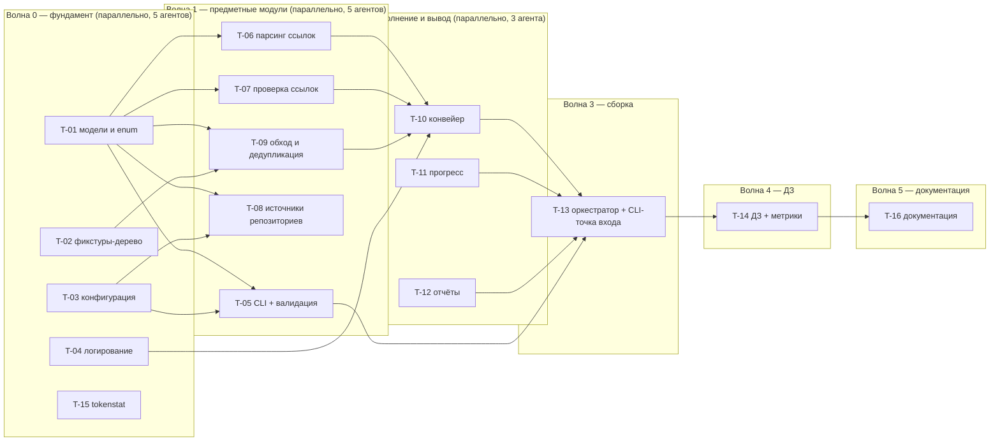

# hw01 «Markdown / Git Scanner» — ТЗ для агентов: разработка, отладка, тестирование модулей

> **Источники (обязательны к прочтению исполнителем):**
> - **правила разработки и тестирования**: [`hw01_mdscan_dev_test_spec_2026-08-16.md`](../specs/hw01_mdscan_dev_test_spec_2026-08-16.md)
> - часть 1/2 — решения: [`hw01_mdscan_reasoning_2026-08-16.md`](../specs/hw01_mdscan_reasoning_2026-08-16.md) (D1–D19)
> - часть 2/2 — архитектура: [`hw01_mdscan_architecture_2026-08-16.md`](../specs/hw01_mdscan_architecture_2026-08-16.md) (раздел 0 — обязательные требования, C1–C4, D1–D5 динамика)
>
> **Цель этого документа**: нарезать работу на **самостоятельные модули**, каждый из которых
> отдельный агент может написать, отладить и покрыть тестами **независимо от остальных**.
> Результат прогона — набор модулей, у каждого зелёный `pytest`.
>
> - **Дата**: 2026-08-16 · **Статус**: ✅ выполнен 2026-08-17 (T-01…T-16), см. `TASK_hw01_mdlinks.md` · 🔧 **ревью 4** (сверка контрактов
>   тасков со спекой после ревью 3, скрытые зависимости между тасками) внесено, список —
>   [`hw01_mdscan_review4_fixes_2026-08-16.md`](../specs/hw01_mdscan_review4_fixes_2026-08-16.md)
> - 🔧 **ревью 5** (2026-08-16, перед запуском скилла по команде Alex): скрытые зависимости T-04→T-03 и T-08→T-09
>   внутри волн сняты, недостающие файлы/классы, `errors.py`, `FixtureTreeBuilder` → `homework/hw01_mdlinks/support/`,
>   `RepositorySource.cleanup()`, `ProgressFactory`, дубли `requestId` в JSONL — список
>   [`hw01_mdscan_review5_fixes_2026-08-16.md`](../specs/hw01_mdscan_review5_fixes_2026-08-16.md)
> - Заменяет ранний `hw01_mdscan_spec_2026-08-16.md` (написан до ревью 1–2, ⛔ не использовать)
> - Макеты M1–M5 (часть 1 D16, часть 2 §7 «SP») **вошли в таски** как их первые тесты:
>   M1 → T-10 · M2 → T-06 · M3 → T-09 · M4 → T-08 · M5 → T-11. Отдельной фазы макетов нет.

---

## 0. Правила, действующие на КАЖДОГО агента

**Правила разработки и тестирования вынесены в отдельную спеку** —
[`hw01_mdscan_dev_test_spec_2026-08-16.md`](../specs/hw01_mdscan_dev_test_spec_2026-08-16.md).
Она обязательна к прочтению исполнителем и вкладывается в промпт каждого агента.

Коротко, что там (полные формулировки — в самой спеке):

| Раздел спеки | О чём |
|---|---|
| 1. Что считается модулем | один контракт · один тестовый файл · проверяется в одиночку |
| 2. Правила разработки | стиль ООП, правило владения данными, исключения и логирование, зависимости |
| 3. Стратегия тестирования | уровни, жёсткие запреты (сеть, `sleep`, `TestRunner`), обязательные приёмы, наборы данных, локальный HTTP-сервер |
| 4. Соглашения по именам | файлы, тесты, фикстуры |
| 5. Отладка | что делать, когда красное; флаки — дефект |
| 6. Definition of Done | 9 пунктов готовности модуля |
| 7. Форма отчёта | что агент присылает в конце |
| 8. Приёмка | делает оркестрант: `git diff`, свои прогоны, ≤2 возврата |

**Границы работы агента** (повторяю здесь, потому что нарушают чаще всего):

1. Пишешь **только** файлы своего таска. Нашёл дефект у соседа → в отчёт, не правь.
2. Не создаёшь классы «на будущее» — только перечисленное в таске.
3. Не меняешь публичные контракты `Protocol`: расхождение → остановись и спроси.
4. Не пишешь в `.claude/worktrees/*` (правило 03).

---

## 1. Карта модулей и волны запуска

Волна = набор тасков **без зависимостей друг от друга**, их можно отдать агентам параллельно.



🔧 ревью 4 — **скрытые зависимости внутри «параллельных» волн сняты через `Protocol`, которым владеет
потребитель** (DIP): T-07 не ждёт T-06 (заголовки — через `HeadingSource`), T-11 не ждёт T-10 (счётчики —
через `ProgressSource`), T-07/T-10 не ждут T-11 (`Notifier` + `NullNotifier` лежат в T-01). Кто чем
владеет — таблица в спеке разработки, §2.5.
🔧 ревью 5 — ещё две сняты: **T-09 не ждёт T-08** (список файлов из git — через `GitFileLister`, владеет T-09;
`GitAdapter` подходит структурно), **T-04 не ждёт T-03** (`LoggingSetup.start` принимает примитивы, не `ScanConfig`).
T-06 реализует `HeadingSource` **не импортируя** `checking.*` — совпадение по структуре (иначе T-06 ждал бы T-07).

| Волна | Таски | Агентов | Что можно проверить в конце волны |
|---|---|---|---|
| 0 | T-01 · T-02 · T-03 · T-04 · T-15 | 5 | модели, дерево-фикстура, конфиг, лог, счётчик токенов |
| 1 | T-05 · T-06 · T-07 · T-08 · T-09 | 5 | CLI, парсер, чекеры, источники, обход |
| 2 | T-10 · T-11 · T-12 | 3 | конвейер на пустышках, прогресс, отчёты |
| 3 | T-13 | 1 | сквозной прогон `python -m core.mdscan …` |
| 4 | T-14 | 1 | `python run_hw.py hw01`, метрики ДЗ |
| 5 | T-16 | 1 | документация с реальными числами (раздел 0 части 1) |

---

## 2. Таски

Формат каждого: **цель · файлы · контракт · что сделать · тесты · DoD · запрещено**.

---

### T-01 · Скелет пакета, модели данных, перечисления и общие контракты

**Цель**: единые типы и общие `Protocol`, на которых говорят все остальные модули; пакет импортируется.

**Файлы**
```
pyproject.toml                        # 🔧 только extra `hw01`: markdown-it-py, mdit-py-plugins, GitPython, PyYAML (rich — отдельно, опционально)
core/mdscan/__init__.py · core/mdscan/{enums,models,config,cli,cli/validation,source,discovery,parsing,parsing/rules,checking,runtime,log_setup,reporting}/__init__.py  # пустые (🔧 р5: + cli/validation, parsing/rules)
core/mdscan/errors.py                 # 🔧 р5: все исключения пакета в одном файле (исключение из «класс = файл», как enums)
core/mdscan/enums/link_kind.py        · check_status.py · link_origin.py · source_kind.py
core/mdscan/models/md_link.py         · md_file_result.py · repo_info.py
core/mdscan/models/md_task.py         · scan_summary.py · progress_snapshot.py
core/mdscan/runtime/notifier.py       · null_notifier.py     # 🔧 общий контракт зоны 2 (нужен T-07, T-10, T-11)
tests/hw01/__init__.py · tests/hw01/test_models.py
```

**Контракт**
```python
class LinkKind(Enum):    LOCAL, ANCHOR, GITHUB, URL, MAILTO, TEL, WIKILINK, FOOTNOTE_URL, UNKNOWN
class CheckStatus(Enum): OK, BROKEN, TIMEOUT, SKIPPED
class LinkOrigin(Enum):  INLINE, REFERENCE, AUTOLINK, WIKILINK, FOOTNOTE
class SourceKind(Enum):  LOCAL, REMOTE_REPO, GITHUB_ORG   # 🔧 без YAML: `yaml` — ветка CLI (T-05), а не вид источника

@dataclass(slots=True)
class MdLink:
    target: str; origin: LinkOrigin; line: int
    kind: LinkKind = LinkKind.UNKNOWN
    status: CheckStatus = CheckStatus.SKIPPED
    detail: str = ""; http_code: int = 0

@dataclass(frozen=True, slots=True)
class RepoInfo:
    root: Path; remote_url: str = ""; web_url: str = ""; is_nested: bool = False

@dataclass(frozen=True, slots=True)
class MdTask:
    repo: RepoInfo; md_file: Path

@dataclass(slots=True)
class MdFileResult:
    repo: RepoInfo; md_file: Path; rel_path: str
    links: list[MdLink] = field(default_factory=list)
    error: str = ""; seconds: float = 0.0; thread_name: str = ""
    @property
    def ok(self) -> bool: ...          # error == ""
    @property
    def broken_count(self) -> int: ... # ссылок со статусом BROKEN/TIMEOUT

@dataclass(frozen=True, slots=True)
class ScanSummary:
    counters: dict[str, float]; duration_sec: float; exit_code: int

@dataclass(frozen=True, slots=True)
class ProgressSnapshot:              # 🔧 срез счётчиков для зоны 1 (читает T-11, отдаёт T-13)
    repos_total: int; repos_done: int; md_found: int; parsed: int
    task_qsize: int; result_qsize: int; links: int; broken: int

class Notifier(Protocol):            # 🔧 зона 2 (D3.5): любой модуль → show(); реализует ProgressReporter (T-11)
    def show(self, text: str) -> None: ...
class NullNotifier:                  # Null Object: прогресс выключен — вызовы бесплатны
    def show(self, text: str) -> None: ...

# errors.py — 🔧 р5: единый набор исключений (владелец T-01; бросают T-03/T-06/T-08, ловят T-05/T-10/T-13)
class MdScanError(Exception): ...                 # базовое
class ConfigError(MdScanError): ...               # ошибка конфигурации (код 2)
class UnknownFieldError(ConfigError): ...         # -поле:значение с неизвестным полем; в тексте «похожие поля: …»
class MarkdownReadError(MdScanError): ...         # файл не читается / битая кодировка (ловит worker → result.error)
class GitUnavailableError(MdScanError): ...       # нет бинарника git (код 3)
class GitHubDiscoveryError(MdScanError): ...      # gh/API не смогли раскрыть организацию; 429 — с временем сброса
```

**Что сделать**: только объявления, никакой логики кроме двух `@property` у `MdFileResult`;
extra `hw01` в `pyproject.toml`; пустые `__init__.py` пакетов, чтобы остальные таски не толкались
за одни и те же файлы. Пакет `core/tokenstat/` и его `__init__.py` создаёт **T-15** (тоже волна 0),
T-01 его не трогает. Все исключения — в `errors.py`; другие таски **не объявляют** своих.

**Тесты**
1. `RepoInfo`, `MdTask`, `ScanSummary` неизменяемы → `FrozenInstanceError`.
2. `MdLink` изменяем (чекер пишет `status`), значения по умолчанию корректны.
3. `MdFileResult.ok` — `True` при пустом `error`, `False` иначе.
4. `broken_count` считает `BROKEN` + `TIMEOUT`, не считает `OK`/`SKIPPED`.
5. Все `Enum` содержат ровно перечисленные значения (защита от «дописал лишнее»).
6. `NullNotifier().show("x")` ничего не делает и не бросает; `ProgressSnapshot` неизменяем.
7. `pyproject.toml` содержит extra `hw01` с 4 зависимостями (разбор `tomllib`); сам `pip install` в тесте **не запускается**.
8. 🔧 р5: иерархия исключений: все наследуют `MdScanError`, `UnknownFieldError` — от `ConfigError`.

**DoD**: `pytest tests/hw01/test_models.py -q` зелёный; `import core.mdscan` и все подпакеты импортируются.

**Запрещено**: логика проверки/парсинга внутри моделей; методы, которых нет в контракте.

---

### T-02 · Генератор тестового дерева (фикстуры)

**Цель**: воспроизводимое дерево `.md`, на котором тестируются все остальные модули.

**Файлы**
```
homework/hw01_mdlinks/support/__init__.py             # 🔧 р5: генератор живёт в пакете ДЗ, а не в tests/ —
homework/hw01_mdlinks/support/fixture_tree_builder.py #   его зовёт и pytest, и `run_hw.py hw01` (T-14); из tests/ импорт невозможен
homework/hw01_mdlinks/support/expectations.py         # ожидания набора A рядом с генератором
tests/hw01/conftest.py                                # фикстура reference_tree + опция --rebuild-fixtures (только T-02)
tests/hw01/test_fixture_tree.py
```
`homework/hw01_mdlinks/__init__.py` **не создавать** — его пишет T-14 (иначе два таска в одном файле; пакет
`support/` при этом импортируется как `homework.hw01_mdlinks.support` — `homework/hw01_mdlinks/` без `__init__.py`
работает как namespace-пакет, корень репо в `sys.path` через корневой `conftest.py`).

**Контракт**
```python
@dataclass(frozen=True, slots=True)
class Expectations:                    # ожидания набора A (expectations.py) — 🔧 объявлен явно
    files_total: int; links_total: int; broken_total: int          # 7
    links_by_kind: dict[LinkKind, int]
    links: frozenset[tuple[str, str, LinkKind]]                     # (rel_path, target, kind)

@dataclass(frozen=True, slots=True)
class ReferenceTree:
    root: Path; expectations: Expectations

class FixtureTreeBuilder:
    def reference(self, root: Path) -> ReferenceTree: ...   # набор A, фиксированный; каталог есть → переиспользует
    def generated(self, root: Path, files: int, seed: int) -> Path: ...  # набор B
```

`tests/hw01/conftest.py` создаёт **этот таск** (и только он — остальные его не правят): фикстура
`reference_tree` (session scope, строит в `out/hw01/fixture_tree/`) и опция pytest `--rebuild-fixtures`
(пересоздать с нуля, часть 1 D1). Другие таски свои фикстуры держат в собственных тестовых файлах
или в `tests/hw01/support/<name>.py`.

**Что сделать (набор A)** — строится в `out/hw01/fixture_tree/` (вне git):
- глубина вложенности до 5, 2–3 `.md` в папке, ≤ 4 ссылки в файле;
- всего ≈ 25–30 файлов, ≈ 80 ссылок, из них **ровно 7 битых** (решение Alex);
- обязательно присутствуют «злые» случаи (D1 части 1):
  ссылка внутри ``` fenced code ``` · reference-ссылка `[t][id]` + `[id]: docs/a.md` ·
  путь с пробелами `<path with spaces.md>` · путь с кириллицей · `../../README.md` ·
  битая ссылка на несуществующий файл · битый якорь `#нет-такого` · `a.md#раздел` (якорь в другом файле) ·
  UTF-8-SIG · файл с битым байтом ·
  пустой `.md` · файл с расширением `.markdown` · `file:///…` · `mailto:` · `tel:` ·
  внешний URL · GitHub-URL · `[[wikilink]]` · сноска `[^1]` с URL.
- **ожидания** (`expectations.py`): сколько файлов, сколько ссылок каждого `LinkKind`,
  сколько битых, полный список `(rel_path, target, kind)` — эталон для метрик качества.

**Что сделать (набор B)**: `generated(root, files, seed)` — дерево заданного размера,
детерминированное по сиду, в `out/hw01/gen_tree/`.

**Тесты**
1. `reference()` в два разных `tmp_path` даёт **побайтово одинаковые** деревья (сравнение по файлам).
2. Число файлов и ссылок совпадает с `expectations`.
3. Битых ровно 7.
4. Каждый «злой» случай присутствует (по одному assert на случай).
5. `generated(files=50, seed=1)` даёт ровно 50 файлов; другой сид → другое дерево.
6. Повторный вызов при существующем каталоге не падает.

**DoD**: дерево строится на Windows и Linux, каталог `out/` не попадает в git.

**Запрещено**: класть дерево в `tests/` или в git; хранить ожидания в отдельном json; импортировать из `core.mdscan`
что-либо кроме `enums.link_kind.LinkKind` (T-01 — та же волна, поэтому оркестрант принимает T-02 **после** T-01).

---

### T-03 · Конфигурация: defaults → yaml → командная строка

**Цель**: собрать `ScanConfig` по приоритету и уметь напечатать всю конфигурацию.

**Файлы**
```
core/mdscan/config/defaults.py · config_draft.py · scan_config.py · yaml_config_loader.py   # 🔧 р5: + config_draft.py (часть 2 §4)
core/mdscan/config/cli_override_applier.py · config_printer.py
tests/hw01/test_config.py
```
`scan_config.py` держит `ScanConfig` **и** вложенные frozen-секции (`SourceConfig`, `ScanSection`, `WorkersConfig`, …) —
конфиг-модуль, исключение из «класс = файл» (правило 09 п.2). `UnknownFieldError` — из `core/mdscan/errors.py` (T-01), не своя.

**Контракт**
```python
@dataclass(slots=True)
class ConfigDraft:                       # 🔧 изменяемый черновик фазы 0 (живёт только до freeze)
    data: dict[str, Any]                 # дерево значений
    sources: dict[str, str]              # "workers.parse" → "d" | "y" | "c"

@dataclass(frozen=True, slots=True)
class ScanConfig:   # вложенные frozen-секции: source, scan, workers, parser, checks,
    ...             # http, progress, logging, report, run — состав в части 2, раздел 2 (включая http.user_agent)
    @classmethod
    def from_draft(cls, draft: ConfigDraft) -> "ScanConfig": ...   # 🔧 единственная точка сборки
# 🔧 р5: служебное поле source.targets_resolved: tuple[tuple[str, SourceKind], ...] (по умолчанию ()) — пишет V5 (T-05)
#   в draft.data["source"]["targets_resolved"]; в mdscan.yaml НЕ выводится, через -source.targets_resolved НЕ задаётся
#   (UnknownFieldError). ConfigPrinter показывает его отдельной строкой «цели». Списки из yaml → в ScanConfig кортежи.

class YamlConfigLoader:
    def load(self, path: Path) -> ConfigDraft: ...     # defaults + yaml; нет файла → создаёт из defaults с комментариями
class CliOverrideApplier:
    def apply(self, draft: ConfigDraft, overrides: list[str]) -> None: ...   # ["-workers.parse:8", …]; неизвестное поле → UnknownFieldError с подсказкой
class ConfigPrinter:
    def render(self, config: ScanConfig, sources: dict[str, str]) -> str: ...  # usage + примеры + таблица d/y/c (D19.3)
```

`CliOverrideApplier` вызывается **из правила V3** цепочки валидации (T-05), а не после неё —
переопределения должны быть применены до проверок каталогов V9/V10 (часть 2, C3, ревью 3).

**Что сделать**
- Полный набор полей и значений по умолчанию — часть 2, раздел 2 (скопировать точно).
- Приоритет `defaults < yaml < cmdline`; для каждого поля запоминается источник (`d`/`y`/`c`).
- Холодный старт: файла нет → создать `mdscan.yaml` **с комментариями из части 2** → лог `INFO`.
- Разбор переопределения: режем по **первому** `:`; путь к полю через точку; тип берётся из
  значения по умолчанию (`int`, `float`, `bool`, `str`, список через запятую).
- Неизвестное поле → исключение с текстом «похожие поля: …» (код возврата 2 обеспечит CLI).

**Тесты**
1. Нет файла → создан, содержимое парсится, значения = defaults.
2. Приоритет: поле в yaml перекрывает default; `-поле:значение` перекрывает yaml.
3. Приведение типов: `-workers.parse:8` → `int`; `-progress.enabled:false` → `bool`;
   `-scan.md_extensions:.md,.markdown` → список.
4. Неизвестное поле → ошибка с подсказкой.
5. Значение с двоеточием: `-report.title:Итоги: dsp-gpu` → title = `Итоги: dsp-gpu`.
6. `ScanConfig` неизменяем.
7. `ConfigPrinter` печатает usage, примеры, все поля и правильный источник у каждого.
8. `ScanConfig.from_draft` — единственный способ собрать конфиг; поля `http.user_agent`, `source.keep_clones` присутствуют.

**DoD**: `pytest tests/hw01/test_config.py -q` зелёный; yaml читается и создаётся на обеих ОС.

**Запрещено**: хардкодить значения по умолчанию где-либо, кроме `defaults.py`.

---

### T-04 · Логирование (многопоточное)

**Цель**: лог, в который безопасно пишут все потоки; имя файла по стандарту.

**Файлы**
```
core/mdscan/log_setup/logging_setup.py · log_format.py · log_naming.py
tests/hw01/test_logging.py
```

**Контракт**
```python
class LoggingSetup:                                 # 🔧 р5: примитивы вместо ScanConfig — T-04 не ждёт T-03 (одна волна)
    def start(self, log_file: Path | None, level: str, header: Mapping[str, str]) -> logging.Logger: ...
        # log_file=None → NullHandler (logging.enabled: false); level: "DEBUG"|"INFO"|"WARNING"; header — шапка (D9)
    def stop(self) -> None: ...                     # дожидается разбора очереди; повторный stop() безопасен
class LogFormat:                                    # log_format.py: Formatter «время | уровень | поток | repo | file | сообщение»
    def formatter(self) -> logging.Formatter: ...   # поля repo/file — через extra=..., отсутствуют → "-"
class LogNaming:
    def build(self, scope: str, when: datetime, ext: str) -> str: ...  # scope_YYYY-MM-DD_HH-MM-SS.ext
```

**Что сделать**
- `QueueHandler` в потоках → `QueueListener` → `FileHandler`; воркеры не блокируются на диске.
- Формат строки: `время | уровень | поток | repo | file | сообщение`.
- Шапка файла на старте: scope, время, вход, workers, включённые проверки, путь к отчёту (D9).
- Имена: `<scope>_<YYYY-MM-DD>_<HH-MM-SS>.log`; метка времени **одна на прогон**
  (она же у отчёта — передаётся снаружи, не генерится дважды).
- Уровень по умолчанию `INFO`; `DEBUG` включается конфигом; `logging.enabled: false` → `NullHandler`,
  файл не создаётся, вызовы логгера не падают.
- Логгер — именованный `core.mdscan` (модули берут `logging.getLogger("core.mdscan.<пакет>")`), корневой не трогаем.
  Оркестратор (T-13) вычисляет `log_file = Path(config.logging.dir) / LogNaming().build(scope, when, "log")` и передаёт сюда.

**Тесты**
1. 5 потоков × 200 записей → в файле ровно 1000 строк, ни одной битой.
2. Формат строки соответствует шаблону (regex).
3. Шапка присутствует и содержит все поля.
4. `stop()` дожидается очереди: последняя запись присутствует.
5. `LogNaming.build` даёт ожидаемое имя для scope с пробелами/кириллицей (нормализация).
6. `logging.enabled: false` → файла нет, `logger.info(...)` не бросает.

**DoD**: тест на 1000 строк проходит стабильно 3 запуска подряд.

**Запрещено**: писать в файл напрямую из воркеров.

---

### T-05 · CLI: разбор аргументов и цепочка валидации

**Цель**: закон CLI (D12) и 10 правил проверки.

**Файлы**
```
core/mdscan/cli/argument_parser.py · cli_arguments.py      # 🔧 usage печатает ConfigPrinter (T-03); usage_printer.py нет
core/mdscan/cli/validation/validation_context.py · validation_result.py   # 🔧 р5: класс = файл
core/mdscan/cli/validation/rule.py · chain.py · rule_arg_count.py · rule_first_arg_is_target.py
core/mdscan/cli/validation/rule_override_syntax.py · rule_path_normalization.py
core/mdscan/cli/validation/rule_target_kind.py · rule_path_is_directory.py
core/mdscan/cli/validation/rule_path_readable.py · rule_git_repository.py
core/mdscan/cli/validation/rule_output_dir.py · rule_write_permission.py
tests/hw01/test_cli.py
```

**Контракт**
```python
@dataclass(frozen=True, slots=True)
class CliArguments:                      # результат разбора argv (без проверок)
    target: str | None                   # первый аргумент или None
    overrides: tuple[str, ...]           # сырые "-поле:значение"
    help_requested: bool                 # -h / --help / -?

class ArgumentParser:
    def parse(self, argv: Sequence[str]) -> CliArguments: ...

@dataclass(slots=True)
class ValidationContext:                 # 🔧 цепочка работает над (аргументы + черновик конфига)
    args: CliArguments
    draft: ConfigDraft                   # из T-03; V3 применяет overrides сюда, V5 пишет виды целей

@dataclass(frozen=True, slots=True)
class ValidationResult:
    ok: bool; exit_code: int = 0; message: str = ""

class ValidationRule(Protocol):
    def validate(self, ctx: ValidationContext) -> ValidationResult: ...

class ValidationChain:
    def __init__(self, rules: Sequence[ValidationRule]) -> None: ...
    def run(self, ctx: ValidationContext) -> ValidationResult: ...   # первый не-ok останавливает цепочку
```
Порядок правил V1…V10 — часть 2, раздел 1.3 (не менять). **V3** вызывает `CliOverrideApplier`
(T-03). **V5 `TargetKindRule`** классифицирует **все** цели — первый аргумент и каждый элемент
`source.repositories[]` — и записывает результат в черновик (`source.targets_resolved:
[(адрес, SourceKind), …]`); при цели `yaml` берёт `source.target` + `source.repositories`; пусто → код 2.
`SourceFactory` (T-08) второй раз ничего не определяет (часть 2 инвариант 23).
🔧 р5: если цель — не `yaml`, V5 записывает её в `source.target`; `source.kind != auto` → V5 берёт указанный вид без
детекции; для `yaml` — `targets_resolved` = `target` (если не пуст) + `repositories[]`. V6/V7 работают только для целей
вида `LOCAL`; V8 — `WARNING`, не ошибка. При коде 2 лог и отчёт **не создаются** (`mdscan.yaml` при холодном старте
создаёт `YamlConfigLoader` до цепочки — это норма D19).

**Закон CLI (дословно)**
```
1. Аргументов НЕТ        → печать конфигурации, код 0
2. Аргументов ≥ 1        → ПЕРВЫЙ аргумент ВСЕГДА цель (4 ветки)
3. Не подходит ни ветке  → ошибка, код 2
4. Остальные             → только -поле:значение, порядок любой
```
Ветки цели: локальный каталог · URL репозитория · URL организации · слово `yaml`.
Исключение: `-h` / `--help` / `-?` первым аргументом = как без аргументов.

**Тесты**
1. 0 аргументов → печать конфига, код 0.
2. `-h` → то же.
3. Каталог → ветка `local`; `git@…/repo.git` → `remote_repo`; `https://github.com/dsp-gpu` → `github_org`; `yaml` → `yaml`.
4. Первый аргумент `-workers.parse:8` → код 2 с внятным текстом.
5. Второй позиционный → код 2 с подсказкой про `-logging.dir:`.
6. Каждое правило V1…V10 — отдельный тест на нарушение.
7. Путь с пробелами и кириллицей нормализуется.
8. Порядок `-поле:значение` не влияет на результат.
9. `-logging.dir:<новый каталог>` + V9 → каталог создан **из переопределённого** значения (V3 раньше V9).
10. `yaml` при пустых `target` и `repositories` → код 2; при списке из 3 разных видов →
    `targets_resolved` содержит 3 записи с верными `SourceKind`.
11. При `-h` / 0 аргументов правила V4…V10 не выполняются (каталоги не создаются).

**DoD**: матрица аргументов покрыта полностью; коды возврата 0/2 соответствуют части 2.

**Запрещено**: вводить флаги (`--workers` и т.п.); менять порядок правил.

---

### T-06 · Парсинг: чтение файла, извлечение и классификация ссылок

**Цель**: из текста `.md` получить список `MdLink` с категориями.

**Файлы**
```
core/mdscan/parsing/markdown_reader.py · link_extractor.py · markdown_it_link_extractor.py
core/mdscan/parsing/markdown_it_heading_source.py   # 🔧 реализация HeadingSource (контракт — в T-07)
core/mdscan/parsing/link_classifier.py
core/mdscan/parsing/rules/link_rule.py · rule_wikilink.py · rule_footnote.py · rule_anchor.py
core/mdscan/parsing/rules/rule_mailto.py · rule_tel.py · rule_github.py · rule_http.py
core/mdscan/parsing/rules/rule_file_url.py · rule_local_path.py          # 9 правил
tests/hw01/test_parsing.py
```

**Контракт**
```python
class MarkdownReader:
    def read(self, path: Path) -> str: ...            # utf-8 / utf-8-sig; ошибка → MarkdownReadError с текстом
class LinkExtractor(Protocol):
    def extract(self, text: str) -> tuple[MdLink, ...]: ...
class MarkdownItHeadingSource:                        # реализует checking.HeadingSource (T-07) СТРУКТУРНО —
    def headings(self, text: str) -> tuple[str, ...]: ...   # 🔧 р5: checking.* НЕ импортировать (одна волна); заголовки по порядку
class LinkRule(Protocol):
    def matches(self, link: MdLink) -> bool: ...
    @property
    def kind(self) -> LinkKind: ...
class LinkClassifier:
    def __init__(self, rules: Sequence[LinkRule]) -> None: ...
    def classify(self, link: MdLink) -> LinkKind: ...   # первое сработавшее правило; иначе UNKNOWN
```

**Что сделать**
- Библиотека — `markdown-it-py`, пресет `gfm-like`, плагины `footnote`, `attrs`, `wikilinks`.
- Обход токенов: inline-ссылки, изображения, автолинки, reference-ссылки (разрешает сам парсер),
  сноски, wikilinks; номер строки — из `token.map`.
- `origin` заполняется (`INLINE` / `REFERENCE` / `AUTOLINK` / `WIKILINK` / `FOOTNOTE`).
- Порядок правил классификации задаётся явно списком (часть 1 D8.3): **wikilink → footnote** (по
  `link.origin`) → anchor → mailto → tel → github → http → file_url → local_path.
  **GithubRule строго до HttpRule.** 🔧 ревью 4: было без `footnote` и в другом порядке.
- Чтение: UTF-8 и UTF-8-SIG; ошибка декодирования → `MarkdownReadError` из `core/mdscan/errors.py` (T-01) с понятным
  текстом (ловит worker). Своих исключений не заводить.
- Тест 7 (пороги на наборе A) использует фикстуру `reference_tree` из `tests/hw01/conftest.py` (T-02) и
  `Expectations` из `homework.hw01_mdlinks.support.expectations`.

**Тесты** (на наборе A из T-02 и на строках)
1. `[x](docs/a.md)`, ``, `[id]: docs/a.md` + `[t][id]`, `<autolink>`, `[[wiki]]`, `[^1]`.
2. Ссылка внутри ``` fenced code ``` и в inline `code` **не извлекается**.
3. Номер строки совпадает с реальным.
4. Классификация: таблица «строка → категория», включая `file:///…` → `LOCAL`.
5. GitHub-URL классифицируется как `GITHUB`, а не `URL` (тест на порядок правил).
6. UTF-8-SIG читается; битый байт → понятная ошибка.
7. На наборе A: `f1_score ≥ 0.95` для извлечения (множество `(rel_path, target, kind)`) и
   `accuracy ≥ 0.98` для классификации — считать **существующими** функциями `core.metrics`
   (`f1_score`, `accuracy`), новых метрик не заводить (часть 2 §9.2).
8. `MarkdownItHeadingSource.headings` отдаёт заголовки всех уровней в порядке появления, из code-блоков — нет.

**DoD**: пороги качества достигнуты; тест порядка правил присутствует.

**Запрещено**: писать regex-парсер Markdown; трогать проверку ссылок (это T-07).

---

### T-07 · Проверка ссылок: локальные, якоря, HTTP

**Цель**: заполнить `status`, `detail`, `http_code` у каждой ссылки.

**Файлы**
```
core/mdscan/checking/link_checker.py · heading_source.py · checker_factory.py
core/mdscan/checking/local_file_checker.py · anchor_checker.py
core/mdscan/checking/http_checker.py · null_checker.py
tests/hw01/test_checking.py   (+ tests/hw01/support/http_server.py — локальный сервер §3.5 спеки разработки)
```

**Контракт**
```python
class LinkChecker(Protocol):
    def check(self, link: MdLink, md_file: Path) -> None: ...   # 🔧 md_file, не base_dir (✅ Alex): пишет в link
class HeadingSource(Protocol):                                 # 🔧 владеет T-07; реализует T-06
    def headings(self, text: str) -> tuple[str, ...]: ...
class CheckerFactory:                                          # создаётся ОДИН раз на прогон (T-13)
    def __init__(self, config: ScanConfig, headings: HeadingSource, notifier: Notifier) -> None: ...
    def for_kind(self, kind: LinkKind) -> LinkChecker: ...     # возвращает общие экземпляры, не новые
# 🔧 р5 — таблица выдачи: LOCAL → LocalFileChecker (внутри — AnchorChecker для `a.md#x`) · ANCHOR → AnchorChecker ·
#   URL и GITHUB → один и тот же HttpChecker · MAILTO/TEL/WIKILINK/FOOTNOTE_URL/UNKNOWN → NullChecker;
#   checks.local=false → LOCAL→Null; checks.anchors=false → ANCHOR→Null и якорная часть `a.md#x` не проверяется;
#   http.enabled=false → URL/GITHUB→Null.
```

**Что сделать**
- `LocalFileChecker`: цель вида `file://…` → `SKIPPED` + `detail="file:// URI не проверяется"` (🔧 р5, по итогу T-02:
  иначе `file:///tmp/report.html` из набора A стал бы 8-й битой); иначе путь резолвится **относительно файла-владельца** (`md_file.parent`),
  а не корня репозитория. Существует → `OK`, иначе `BROKEN` + `detail`. Цель вида `a.md#раздел` →
  файл, затем якорь в **целевом** файле (через `AnchorChecker`, `checks.anchors`).
- `AnchorChecker`: `#x` — заголовки **своего** файла, `a.md#x` — целевого; текст файла читает **сам**
  (`Path.read_text(encoding="utf-8-sig", errors="replace")` — `parsing.MarkdownReader` импортировать нельзя), заголовки через
  `HeadingSource` (в тестах — заглушка), кэш `{Path: slugs}` под `Lock`; сверка по **GitHub-slug**
  (нижний регистр, пробелы → `-`, пунктуация убирается, кириллица остаётся, повтор → `-1`, `-2`).
- `HttpChecker`: `urllib.request` (без `requests`); `HEAD`, при `405/501` — повтор `GET`; таймаут `http.timeout_ms` (по умолчанию 2000);
  заголовок `User-Agent: http.user_agent`; **семафор** на `http.workers`; кэш по URL под `Lock`
  (один адрес — один запрос за прогон); ретраев нет; каждый исход → `notifier.show('[http] … код')`.
  Исходы: `OK` (2xx/3xx) · `BROKEN` (4xx/5xx/DNS) · `TIMEOUT` (нет ответа). **Один экземпляр на прогон.**
- `NullChecker`: `mailto` / `tel` / `wikilink` / `footnote_url` / `unknown` → `SKIPPED`;
  а также любая категория при `http.enabled: false` / `checks.local|anchors: false`.

**Тесты** (сеть только `127.0.0.1`)
1. Локальная: существующая цель → `OK`; несуществующая → `BROKEN`.
2. Относительный путь `../../README.md` из вложенного файла резолвится верно.
3. Якорь: существующий заголовок → `OK`; `#нет-такого` → `BROKEN`; `a.md#раздел` → проверены и файл, и
   заголовок в нём; slug: `## Как запустить` ↔ `#как-запустить`, повтор заголовка → `-1`.
4. HTTP на локальном сервере: `200` → `OK`, `301` → `OK`, `404`/`500` → `BROKEN` + `http_code`.
5. «Висящий» эндпоинт → `TIMEOUT` за время ≈ `timeout_ms`, тест не виснет.
6. Кэш: два одинаковых URL → один сетевой вызов (счётчик на сервере).
7. Семафор: при `http.workers=2` одновременно не больше 2 запросов.
8. `http.enabled: false` → `NullChecker`, ни одного сетевого вызова.
9. Запрос без `User-Agent` сервер отвечает 403, с `http.user_agent` → 200 (режим сервера).
10. `for_kind(URL)` дважды → один и тот же объект `HttpChecker` (общий семафор/кэш).

**DoD**: три исхода различимы; тесты не ходят в интернет.

**Запрещено**: реальные адреса в тестах; возвращать новый объект вместо записи в `link`;
импортировать `parsing.*` (заголовки — только через `HeadingSource`).

---

### T-08 · Источники репозиториев

**Цель**: превратить цель в поток `RepoInfo`.

**Файлы**
```
core/mdscan/source/repository_source.py · source_factory.py · git_adapter.py
core/mdscan/source/local_path_source.py · remote_repo_source.py · github_org_source.py
tests/hw01/test_source.py
```

**Контракт**
```python
class RepositorySource(Protocol):
    def repositories(self) -> Iterable[RepoInfo]: ...
    def cleanup(self) -> None: ...     # 🔧 р5: удалить клоны при keep_clones=false; локальный источник — no-op; зовёт T-13 в finally
class GitAdapter:                      # обёртка GitPython; структурно реализует discovery.GitFileLister (T-09) — discovery.* не импортировать
    def root_of(self, path: Path) -> Path | None: ...
    def submodules(self, root: Path) -> list[Path]: ...
    def listed_md(self, root: Path, extensions: Sequence[str]) -> list[Path]: ...   # 🔧 ls-files --cached --others --exclude-standard: tracked + новые, минус игнорируемое
    def remote_url(self, root: Path) -> str: ...
    def clone(self, url: str, dst: Path, depth: int) -> Path: ...
class SourceFactory:                   # 🔧 читает source.targets_resolved (V5, T-05); ничего не детектит сам
    def for_config(self, config: ScanConfig) -> list[RepositorySource]: ...   # по источнику на цель
```
🔧 р5: внешние вызовы (`gh`, REST API `urllib`) — через инжектируемые вызываемые объекты в конструкторе `GitHubOrgSource`
(`run_gh: Callable[[Sequence[str]], str]`, `http_get: Callable[[str, Mapping[str, str]], tuple[int, str, Mapping[str, str]]]`),
чтобы тесты подменяли их без `monkeypatch` глобалей. Ошибки раскрытия организации → `GitHubDiscoveryError` (errors.py, T-01);
нет `git` → `GitUnavailableError` оттуда же.

**Что сделать**
- `LocalPathSource` — локальный каталог; вне git → работаем как с папкой + `WARNING`.
- `RemoteRepoSource` — `clone --depth 1` в `source.clone_dir`, затем как локальный;
  `keep_clones: false` → `cleanup()` удаляет каталог клона (`shutil.rmtree`, на Windows — с `onexc` для read-only `.git`).
- `GitHubOrgSource` — список репозиториев организации: `discovery: auto` → `gh repo list`,
  затем REST API по `GITHUB_TOKEN`; **пагинация до конца** (`page_size`); фильтры
  `visibility` / `include_forks` / `include_archived`; каждый репозиторий → `RemoteRepoSource`.
- `SourceFactory` — по элементу `source.targets_resolved` создаёт `LocalPathSource` / `RemoteRepoSource` /
  `GitHubOrgSource`; список смешанный (§2.0 части 2). Ветку цели **не определяет** — это V5 (T-05).
- `auth: auto|ssh|https|token` — выбор URL клонирования; `token` → `GITHUB_TOKEN` из окружения, в лог не пишется.
- `web_url` заполняется для отчёта (трио «корневой / репозиторий / файл», D6.4).
- Нет бинарника `git` → понятная ошибка `GitUnavailableError` (код 3 обеспечит T-13).

**Тесты**
1. Каталог вне git → один `RepoInfo`, `WARNING` в логе.
2. Локальный репозиторий (`git init` в `tmp_path`) → корень определён верно.
3. Submodule (`.git` — файл) и вложенный клон (`.git` — каталог) распознаются.
4. `listed_md` не возвращает файлы из игнорируемых каталогов, **но возвращает новый незакоммиченный `.md`**.
5. Нет `git` в PATH → `pytest.skip`.
6. `GitHubOrgSource` с подменённым исполнителем `gh` (заглушка, возвращает JSON) →
   правильный список, фильтры `visibility`/`include_forks`/`include_archived` применены.
7. `discovery: api` с заглушкой `urllib` → пагинация до конца (3 страницы по `page_size`), 429 →
   понятная ошибка с временем сброса; `discovery: gh` без `gh` → ошибка, а не тихий переход на API.
8. Клон вызывается с `--depth 1` (подменённый `GitAdapter.clone` фиксирует аргументы); `keep_clones=false` → после `cleanup()` каталог удалён, `true` → остался.
9. `SourceFactory.for_config` на `targets_resolved` из трёх видов → три источника нужных классов.

**DoD**: сетевых вызовов в тестах нет (только заглушки и локальные репозитории).

**Запрещено**: ходить в реальный GitHub из тестов.

---

### T-09 · Обход дерева и дедупликация

**Цель**: получить уникальные `MdTask`.

**Файлы**
```
core/mdscan/discovery/git_file_lister.py     # 🔧 р5: Protocol — список .md из git; владеет T-09, реализует GitAdapter (T-08) структурно
core/mdscan/discovery/nested_repo_finder.py · markdown_file_finder.py · processed_registry.py
tests/hw01/test_discovery.py
```

**Контракт**
```python
class GitFileLister(Protocol):                     # 🔧 р5: снимает зависимость T-09 → T-08 (одна волна)
    def listed_md(self, root: Path, extensions: Sequence[str]) -> list[Path]: ...
class NestedRepoFinder:
    def find(self, root: Path) -> list[Path]: ...   # каталоги с собственным .git (файл или каталог) ниже root, кроме самого root
class MarkdownFileFinder:
    def __init__(self, lister: GitFileLister, extensions: Sequence[str],
                 respect_gitignore: bool, include_nested: bool) -> None: ...   # примитивы из ScanConfig — передаёт T-13
    def find(self, repo: RepoInfo, nested_roots: list[Path]) -> Iterable[Path]: ...
class ProcessedRegistry:
    def add_if_absent(self, key: tuple[Path, Path]) -> bool: ...   # потокобезопасно
```
В тестах `GitFileLister` — заглушка (список путей); реальный `git` не нужен. `source.*` не импортировать.

**Что сделать**
- Правило ближайшего корня (D6.2): файл принадлежит ближайшему вверх git-корню.
- Фильтр по **префиксу пути** (`Path.is_relative_to`), пути разрешаются `resolve()`.
- `include_nested_repos: false` (по умолчанию) → nested-поддеревья исключаются целиком.
- `respect_gitignore: true` → список от `GitAdapter.listed_md`, иначе (или вне git) `rglob` по расширениям.
- `include_nested_repos: false` → `NestedRepoFinder` не вызывается, а поддеревья с собственным `.git`
  всё равно исключаются из `rglob`-обхода (иначе чужие файлы попадут главному).
- Реестр — `set` под `Lock`, ключ `(repo_root, md_file)` после `resolve()`.

**Тесты** (на дереве из T-02 и на синтетике)
1. Файл nested-репозитория попадает в задачи **ровно один раз**.
2. `project/vendor/notes.md` (рядом с nested, но не в нём) **не** теряется.
3. Каталог с совпадающим именем (`docs`) не выкидывается по ошибке имени.
4. Повторная подача того же репозитория не создаёт вторых задач.
5. Symlink на просканированную папку не даёт дублей.
6. `.md` и `.markdown` оба находятся; `.git/` пропускается.
7. Реестр потокобезопасен: 5 потоков × 1000 ключей → ровно 1000 уникальных.

**DoD**: дедупликация доказана тестом, а не рассуждением.

**Запрещено**: фильтровать по имени каталога вместо префикса пути.

---

### T-10 · Конвейер: очереди, сентинелы, worker, наблюдатель

**Цель**: двухстадийный конвейер, который не виснет и ничего не теряет.

**Файлы**
```
core/mdscan/runtime/queues.py · sentinels.py · markdown_worker.py
core/mdscan/runtime/base_observer.py · collecting_observer.py · statistics_collector.py
tests/hw01/test_pipeline.py
```

**Контракт**
```python
END_DISCOVERY: Final = _Sentinel("END_DISCOVERY")
END_RESULTS:   Final = _Sentinel("END_RESULTS")
TaskQueue   = queue.Queue[MdTask | _Sentinel]      # queues.py: типизированные псевдонимы, без наследования
ResultQueue = queue.Queue[MdFileResult | _Sentinel]

class BaseObserver(threading.Thread):     # Template Method; очередь и сентинел — через конструктор (DI, D2)
    def __init__(self, q: queue.Queue, sentinel: object, name: str) -> None: ...
    def run(self) -> None: ...            # get → on_item → task_done в finally → выход по сентинелу (task_done и на него)
    def on_item(self, item) -> None: ...  # абстрактный
    def on_error(self, exc: Exception) -> None: ...   # лог ERROR с трейсом (D2.1), поток живёт
    def on_finish(self) -> None: ...

class MarkdownWorker(BaseObserver):       # 🔧 ревью 3/4: потребитель TaskQueue, а не отдельный класс с циклом
    def __init__(self, tasks: TaskQueue, results: ResultQueue, name: str,
                 reader: MarkdownReader, extractor: LinkExtractor, classifier: LinkClassifier,
                 checkers: CheckerFactory, notifier: Notifier) -> None: ...
    def on_item(self, task: MdTask) -> None: ...     # read → extract → classify → check → put(result)

class CollectingObserver(BaseObserver):   # потребитель ResultQueue
    results: list[MdFileResult]
    def __init__(self, results_q: ResultQueue, stats: StatisticsCollector) -> None: ...
    def on_item(self, result: MdFileResult) -> None: ...   # results.append + stats.add

class StatisticsCollector:
    def add(self, result: MdFileResult) -> None: ...
    def summary(self, duration_sec: float, fail_on_broken: bool) -> ScanSummary: ...
    def snapshot(self, task_qsize: int, result_qsize: int) -> ProgressSnapshot: ...  # для зоны 1 (T-11 через ProgressSource, T-13)
```

**Что сделать** — порядок операций worker'а (часть 2, C2 вариант A, D4 activity):
`get` → `MdFileResult` из `MdTask` → чтение → извлечение → по каждой ссылке `link.kind = classify(link)`,
`checkers.for_kind(kind).check(link, md_file)` → лог каждой ссылки + `notifier.show('[parse] …')` →
`put(MdFileResult)` → `task_done()` **после** `put` (в `finally` базового класса) → после публикации
объект не изменяется. Исключение на **любом** шаге → `result.error`, результат всё равно публикуется.
Порядок завершения — часть 2, D1 (sequence): `END_DISCOVERY` кладётся **по одному на каждый
parse-worker**, затем `TaskQueue.join()`, затем `END_RESULTS`, затем `ResultQueue.join()`.
Отчёт worker/collector **не строят** — это делает оркестратор после `join()` (инвариант 25).

**Тесты** (реальный разбор не нужен — подставные чекеры/экстрактор; заглушки — duck-typing, без наследования)
1. N задач → N результатов у наблюдателя (ничего не потеряно).
2. Искусственно замедленный worker: его результат попал в отчёт, сентинел не обогнал.
3. `task_done()` вызван столько же раз, сколько `get()`; ни один `join()` не виснет (таймаут в тесте).
4. Исключение в обработке одного файла → событие с `error`, остальные обработаны.
5. `END_DISCOVERY` кладётся ровно `workers.parse` раз; все воркеры вышли.
6. После завершения `threading.enumerate()` не содержит наших потоков.
7. Объект после `put()` не изменяется (проверка по ссылке-двойнику).
8. `task_done()` вызван и для сентинела; `TaskQueue.join()` не виснет при `workers.parse = 3`.
9. Исключение в чекере (не только при чтении) → результат с `error` опубликован.
10. `snapshot()` отражает добавленные результаты; `summary(fail_on_broken=True)` при битых → `exit_code = 1`.

**DoD**: тесты гоняются 5 раз подряд без флаки; все `join()` в тестах — с таймаутом.

**Запрещено**: завершать цикл по «пустой очереди»; `qsize()` в логике завершения.

---

### T-11 · Прогресс: статус по таймеру и строка-сообщение

**Цель**: две зоны вывода, не мешающие результату.

**Файлы**
```
core/mdscan/runtime/progress_source.py                       # 🔧 Protocol: откуда брать срез счётчиков
core/mdscan/runtime/progress_reporter.py
core/mdscan/runtime/progress_view.py · rich_progress_view.py · plain_progress_view.py   # 🔧 Strategy отрисовки (D10)
core/mdscan/runtime/progress_factory.py                      # 🔧 р5: решает enabled/TTY/rich — не оркестратор
tests/hw01/test_progress.py
```
(`Notifier` и `NullNotifier` — в T-01, здесь только используются.)

**Контракт**
```python
class ProgressSource(Protocol):                 # 🔧 владеет T-11; реализует оркестратор (T-13) поверх StatisticsCollector
    def snapshot(self) -> ProgressSnapshot: ...
class ProgressView(Protocol):                   # rich | plain (ANSI); обе за одним интерфейсом
    def draw(self, snap: ProgressSnapshot, messages: Sequence[str]) -> None: ...
    def clear(self) -> None: ...
class ProgressReporter(threading.Thread):       # реализует Notifier (T-01)
    def __init__(self, source: ProgressSource, view: ProgressView, interval_sec: float,
                 message_lines: int, message_ttl_sec: float, clock: Callable[[], float] = time.monotonic) -> None: ...
    def show(self, text: str) -> None: ...      # зона 2, TTL; потокобезопасно
    def stop(self) -> None: ...                 # гасит и стирает строку; join внутри с таймаутом
class ProgressFactory:                          # 🔧 р5
    def create(self, config: ScanConfig, source: ProgressSource,
               stream: TextIO = sys.stderr) -> ProgressReporter | None: ...
        # None, если progress.enabled=false или stream не TTY (тогда T-13 берёт NullNotifier);
        # rich импортируется → RichProgressView, иначе PlainProgressView; поток НЕ стартует — start() зовёт T-13
```

**Что сделать**
- Зона 1 — статус, перерисовка каждые `progress.interval_sec`: репозитории, файлы, очереди,
  ссылки, битые.
- Зона 2 — `message_lines` строк от любого модуля, каждая гаснет через `message_ttl_sec` (5 с).
- Вывод в **stderr**; не TTY → прогресс автоматически отключается.
- Выключено конфигом → объект не создаётся (Null Object), вызовы `show()` бесплатны.
- Считает только чтение счётчиков; на завершение не влияет.

**Тесты**
1. Строка-сообщение исчезает через TTL (управляемое время, без `sleep(5)`).
2. Новое сообщение вытесняет старое.
3. Не TTY (`stream.isatty()` → False) → `ProgressFactory.create` возвращает `None`.
4. Отключён конфигом → `create` возвращает `None`; вызывающий берёт `NullNotifier` (T-01) — `ProgressReporter` не создаётся вовсе.
5. `stop()` стирает строку и завершает поток (`join(timeout)` в тесте).
6. Зона 1 показывает все поля `ProgressSnapshot` из подставного `ProgressSource`.
7. `PlainProgressView` работает без `rich` (модуль скрыт в тесте); `RichProgressView` — при наличии.

**DoD**: прогон с прогрессом и без даёт одинаковый отчёт (проверяется в T-13).

**Запрещено**: писать прогресс в stdout.

---

### T-12 · Отчёты: Markdown и консоль

**Цель**: файл-отчёт и цветная сводка.

**Файлы**
```
core/mdscan/reporting/markdown_report_builder.py · console_renderer.py
core/mdscan/reporting/rich_console_renderer.py · plain_console_renderer.py · renderer_factory.py
tests/hw01/test_reporting.py
```

**Контракт**
```python
class ConsoleRenderer(Protocol):
    def render(self, results: Sequence[MdFileResult], summary: ScanSummary) -> None: ...   # 🔧 порядок как в C4 и у build()
class MarkdownReportBuilder:
    def __init__(self, config: ScanConfig, started_at: datetime) -> None: ...   # 🔧 р5: цель/заголовок/время — отсюда, не из summary
    def build(self, results: Sequence[MdFileResult], summary: ScanSummary) -> str: ...
    # список репозиториев — уникальные `result.repo` (порядок по root); title пуст → имя цели
class RendererFactory:
    def create(self) -> ConsoleRenderer: ...      # rich есть → Rich, иначе Plain
```

**Что сделать** — обязательные секции отчёта:
время старта и длительность · цель · список репозиториев (+`web_url`) · статистика по типам ссылок ·
таблица файлов (репозиторий · путь · ссылок · статус · ошибка) · **битые локальные** ·
**битые HTTP со статус-кодами** · `TIMEOUT` отдельно · файлы с ошибками.
Консоль: таблица итогов; есть `rich` → `RichConsoleRenderer`, нет → `PlainConsoleRenderer` (ANSI).
Сводные считаются своими структурами (`Counter`), pandas/polars **не используем**.

**Тесты**
1. Все обязательные секции присутствуют.
2. Битая HTTP-ссылка попадает в отчёт вместе с кодом.
3. `TIMEOUT` в отдельной секции, не смешан с `BROKEN`.
4. Рендер работает при отсутствии `rich` (модуль скрыт в тесте).
5. Пустой прогон (0 файлов) → отчёт корректен, без исключений.
6. Отчёт детерминирован: два вызова с теми же данными дают одинаковый текст.

**DoD**: отчёт открывается как валидный Markdown; таблицы не разъезжаются на длинных путях.

**Запрещено**: pandas/polars; печать из не-консольного слоя.

---

### T-13 · Оркестратор и точка входа

**Цель**: собрать всё вместе, соблюдая порядок фаз.

**Файлы**
```
core/mdscan/scanner.py                        # 🔧 Scanner (Protocol) — публичное API (D18.5)
core/mdscan/runtime/scan_orchestrator.py      # реализует Scanner
core/mdscan/__main__.py · core/mdscan/__init__.py   # __init__ создан пустым в T-01; здесь — реэкспорт фасада
tests/hw01/test_orchestrator.py
```

**Контракт**
```python
class Scanner(Protocol):
    def scan(self, config: ScanConfig) -> ScanSummary: ...
class ScanOrchestrator:                       # Facade + Controller; ≤ ~120 строк, иначе фаза 1 → PipelineRunner
    def scan(self, config: ScanConfig) -> ScanSummary: ...
```

**Что сделать** (часть 2 D1/D6, часть 1 D4):
- Фаза 0 (`__main__`): `ArgumentParser` → `YamlConfigLoader` → `ValidationChain` V1…V10 (V3 применяет
  переопределения, V5 пишет `targets_resolved`) → `ScanConfig.from_draft` → 0 аргументов / `-h` →
  `ConfigPrinter`, код 0; ошибка → код 2.
- Фаза 1 (`scan`): логгер (`LoggingSetup`, `LogNaming` со scope из цели) → очереди (создаёт сам,
  передаёт через DI) → `CheckerFactory` один раз → `CollectingObserver.start()` →
  `MarkdownWorker.start() × workers.parse` → `ProgressReporter` или `NullNotifier` →
  discover-пул (`ThreadPoolExecutor(workers.discover)`: `SourceFactory.for_config` → по репозиторию
  `NestedRepoFinder` → `MarkdownFileFinder` → `ProcessedRegistry` → `TaskQueue.put`) →
  `future.result()` у каждого → `END_DISCOVERY × workers.parse` → `TaskQueue.join()` → `join()` worker'ов →
  `END_RESULTS` → `ResultQueue.join()` → `collector.join()`.
- Фаза 2: `MarkdownReportBuilder.build(collector.results, summary)` → `report.dir/<scope>_<ts>.md`;
  `RendererFactory.create().render(results, summary)` → stdout; итоги в лог.
- Фаза 3: `progress.stop()`, `source.cleanup()` у каждого источника (🔧 р5, клоны), `logging.stop()` в `finally`;
  `threading.enumerate()` без наших потоков; `return ScanSummary(exit_code)`; `__main__` → `sys.exit`.
- 🔧 р5: `ProgressFactory.create(config, self, sys.stderr)` → `reporter` или `NullNotifier`; `MarkdownFileFinder`
  получает примитивы из `config.scan` и `GitAdapter` как `GitFileLister`; `MarkdownReportBuilder(config, started_at)`;
  `LoggingSetup.start(log_file | None, level, header)`.
- Реализует `ProgressSource` для T-11 поверх `StatisticsCollector.snapshot()` + `qsize()` очередей.
- Коды возврата: 0 / 1 (битые, `run.fail_on_broken`) / 2 (аргументы) / 3 (внутренняя ошибка, `CRITICAL`).

**Тесты**
1. Сквозной прогон на дереве из T-02: числа совпадают с `expectations`.
2. Два прогона подряд дают одинаковый отчёт (кроме времени).
3. `fail_on_broken: true` + битые ссылки → код 1; `false` → код 0.
4. Ошибка записи отчёта → код 3, лог `CRITICAL`.
5. Прогон с `progress.enabled` true/false даёт одинаковый отчёт.
6. Все потоки завершены после `scan()`.
7. Отчёт записан **после** `collector.join()` (подставной collector фиксирует порядок вызовов).
8. `python -m core.mdscan yaml` с `source.repositories` из двух локальных каталогов → оба просканированы.
9. 0 аргументов → печать конфига, код 0, лог и отчёт не созданы (`mdscan.yaml` при холодном старте создаётся — норма D19);
   тест работает в `tmp_path` через `monkeypatch.chdir`.

**DoD**: `python -m core.mdscan <дерево>` отрабатывает от начала до конца; `import core.mdscan` даёт `Scanner`, `ScanConfig`, `ScanSummary`.

---

### T-14 · ДЗ и метрики

**Цель**: `python run_hw.py hw01` и числа для README.

**Файлы**
```
homework/hw01_mdlinks/task.py · __init__.py
homework/registry.py (регистрация)
tests/hw01/test_hw01_task.py
```
🔧 р5: наборы A/B строит `homework.hw01_mdlinks.support.FixtureTreeBuilder` (T-02) в `ctx.out_dir` — из `tests/`
ничего не импортировать. Прогоны — через `Scanner` (`ScanOrchestrator`) с `ScanConfig`, собранным из `ConfigDraft`
(`YamlConfigLoader` по пути `ctx.out_dir / "mdscan.yaml"`, `http.enabled=false`, `progress.enabled=false`).

**Что сделать**
- `Hw01MdLinks(HomeworkTask)`, `hw_id="hw01"` — тонкая оркестровка: конфиг → фасад → метрики.
- Метрики (часть 2, раздел 9): операционные (`ScanSummary.counters`), качество извлечения — ключи
  `extract_f1`, `classify_accuracy` в `HomeworkReport.metrics`, значения считать функциями
  `core.metrics.f1_score` / `accuracy` по `expectations` набора A, параллельность (`speedup`,
  `parallel_efficiency` на наборе B: прогон с `workers.parse=1` и `=5`).
- README ДЗ **не трогать** здесь — числа в README вписывает T-16 по результатам этого таска.

**Тесты**
1. Задание зарегистрировано, `hw_id` уникален.
2. `solve()` возвращает `dict[str, float]`, ключи из списка метрик присутствуют.
3. Метрики качества на наборе A выше порогов.
4. Повторный прогон с тем же сидом даёт те же метрики.

---

### T-15 · Подсчёт токенов (независимый модуль)

**Цель**: посчитать токены прогона по транскрипту сессии.

**Файлы**
```
core/tokenstat/__init__.py · models/__init__.py   # 🔧 р5: создаёт T-15 (T-01 не трогает tokenstat)
core/tokenstat/token_meter.py · models/token_usage.py · models/token_totals.py
core/tokenstat/transcript_token_meter.py          # 🔧 р5: реализация TokenMeter (Protocol без реализации был бы пуст)
core/tokenstat/transcript_reader.py · token_aggregator.py · token_report_builder.py
tests/hw01/test_tokenstat.py
```

**Контракт**
```python
class TokenMeter(Protocol):
    def start(self, label: str) -> None: ...        # запоминает смещение (число строк) главного файла и список subagents/*.jsonl
    def mark(self, agent: str, task: str) -> None: ...   # ручная привязка агента к таску (если TASK= в файле не нашёлся)
    def stop(self) -> None: ...                     # фиксирует конец окна
    @property
    def total(self) -> TokenTotals: ...
    def by_agent(self) -> dict[str, TokenTotals]: ...
    def report(self) -> str: ...

class TranscriptTokenMeter:                         # 🔧 р5: реализует TokenMeter
    def __init__(self, session_file: Path, clock: Callable[[], datetime] = datetime.now) -> None: ...
        # subagents = session_file.parent / session_file.stem / "subagents" / "agent-*.jsonl"

@dataclass(frozen=True, slots=True)
class TokenUsage:    # одна запись: timestamp, model, request_id, input, output, cache_creation, cache_read, thinking
    ...
@dataclass(frozen=True, slots=True)
class TokenTotals:   # суммы тех же полей + requests: int; сложение через __add__
    ...
```

**Что сделать**
- Читает JSONL-транскрипт **сессии** и **все `subagents/agent-*.jsonl`** рядом (транскрипты субагентов —
  отдельные файлы, часть 1 D18, проверено): строки `type == "assistant"`, поля `timestamp`, `requestId`,
  `message.model`, `message.usage.input_tokens`, `output_tokens`, `cache_creation_input_tokens`,
  `cache_read_input_tokens`, `output_tokens_details.thinking_tokens` (может отсутствовать → 0).
- 🔧 р5: **один `requestId` встречается в нескольких строках** (стриминг) с одинаковым `usage` — считать
  **один раз на `requestId`** (берётся последняя строка), иначе суммы завышены в разы. Проверено на реальном транскрипте.
- Считает **только количество** токенов (деньги не считаем).
- Отсчёт от метки старта: смещение в главном файле + список уже существовавших файлов агентов
  (новые после старта = этот прогон); принадлежность агента таску — по ярлыку `TASK=<id>` в первом
  сообщении файла агента; группировка по агенту/задаче/модели; итог «агенты» / «оркестрант».
- Отчёт — отдельный файл `tokens_<YYYY-MM-DD>_<HH-MM-SS>.md`: общий итог, по агентам,
  две строки «агенты» / «оркестрант».

**Тесты** (на синтетическом JSONL из фикстуры)
1. Суммы по полям совпадают с эталоном.
2. Строки до метки старта не учитываются.
3. Группировка по агентам верна.
4. Битая строка JSONL пропускается с `WARNING`, разбор продолжается.
5. Отчёт содержит итог и разбивку.
6. Файл агента из `subagents/` с `TASK=T-06` в первом сообщении попадает в разбивку под `T-06`;
   файл, существовавший до старта, — не учитывается.
7. 🔧 р5: три строки с одним `requestId` и одинаковым `usage` → в сумме учтены один раз.

---

### T-16 · Документация (обязательный шаг, часть 1 раздел 0 / D17) 🔧 ревью 4

**Цель**: проект завершается документацией с реальными числами, а не «кодом, который работает».

**Файлы**
```
homework/hw01_mdlinks/README.md              # условие · что сделано · запуск · метрики (числа из T-14) · выводы
Doc/Modules/mdscan/README.md                 # архитектура: C1–C4, D1–D6, контракты классов, примеры вызова
Doc/Modules/mdscan/CLI.md                    # все параметры (таблица 2.1 части 2), закон CLI, примеры, коды возврата, разбор отчёта
MemoryBank/tasks/TASK_hw01_mdlinks.md · IN_PROGRESS.md · MASTER_INDEX.md · changelog/2026-08.md
```

**Что сделать**: заполнить все разделы README ДЗ (правило 06: условие / что сделано / запуск /
метрики / выводы), перенести диаграммы из части 2 в `Doc/Modules/mdscan/`, описать каждый параметр
конфига («на что влияет, когда менять»), закрыть TASK ✅.

**Тесты (проверка формой, не pytest)**: в README нет плейсхолдеров `_(…)_`; все числа совпадают с
`out/hw01/*.md` последнего прогона; ссылки внутри `Doc/Modules/mdscan/*.md` проходят через сам
сканер: `python -m core.mdscan Doc/Modules/mdscan -http.enabled:false` → код 0.

**DoD**: `python -m core.mdscan Doc/Modules/mdscan -http.enabled:false` → 0 битых; MemoryBank закрыт.

**Запрещено**: писать в документацию числа «примерно» — только из реального прогона; абсолютные
Windows-пути (правило 05).

---

## 3. Итог прогона: что должно получиться

После всех волн в репозитории:

| Модуль | Тестовый файл | Ожидаемый результат |
|---|---|---|
| модели и enum | `tests/hw01/test_models.py` | passed |
| фикстуры | `tests/hw01/test_fixture_tree.py` | passed |
| конфигурация | `tests/hw01/test_config.py` | passed |
| логирование | `tests/hw01/test_logging.py` | passed |
| CLI | `tests/hw01/test_cli.py` | passed |
| парсинг | `tests/hw01/test_parsing.py` | passed (пороги качества) |
| проверка ссылок | `tests/hw01/test_checking.py` | passed (сеть только 127.0.0.1) |
| источники | `tests/hw01/test_source.py` | passed / skipped без git |
| обход | `tests/hw01/test_discovery.py` | passed |
| конвейер | `tests/hw01/test_pipeline.py` | passed, без флаки |
| прогресс | `tests/hw01/test_progress.py` | passed |
| отчёты | `tests/hw01/test_reporting.py` | passed |
| оркестратор | `tests/hw01/test_orchestrator.py` | passed |
| ДЗ и метрики | `tests/hw01/test_hw01_task.py` | passed |
| токены | `tests/hw01/test_tokenstat.py` | passed |
| документация | — (проверка формой + `python -m core.mdscan Doc/Modules/mdscan`) | 0 битых, README без плейсхолдеров |

Финальная проверка: `pytest tests/hw01 -q` — всё зелёное, `python run_hw.py hw01` отрабатывает.

---

## 4. Скил-оркестрант

Скил **написан отдельно**, как положено:

| Что | Путь |
|---|---|
| Скил сборки hw01 | **`.claude/skills/hw01-build/SKILL.md`** |
| Вызов | `/hw01-build` либо «собери hw01», «запусти агентов по hw01» |

Что он делает: фиксирует старт (для учёта токенов) → запускает таски T-01…T-16 **волнами**
агентами Opus (`subagent_type: general-purpose`, `model: opus`, в фоне) → сам принимает работу
(читает `git diff`, лично гоняет `pytest`, цифрам агента не верит) → после последней волны
`pytest tests/hw01 -q` и `python run_hw.py hw01` → считает токены → выдаёт итоговую таблицу
модулей и обновляет MemoryBank.

Гейт: после каждой волны скил показывает результат Alex и ждёт приёмки
(`.claude/rules/10-execution-gate.md`).

🔧 р5 — порядок приёмки внутри волны 0: сначала T-01 (от него зависят тесты T-02: `LinkKind`), потом остальные.
Зависимости hw01 (`markdown-it-py`, `mdit-py-plugins`, `GitPython`, `PyYAML`) ставятся `pip install -e .[hw01]`
**после приёмки T-01** по ОК Alex на гейте волны 0 — без них волна 1 (T-06, T-08) не запускается.

---

*Черновик 2026-08-16. Основание — спека hw01, части 1/2 и 2/2.*
